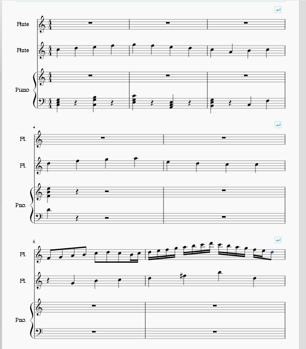
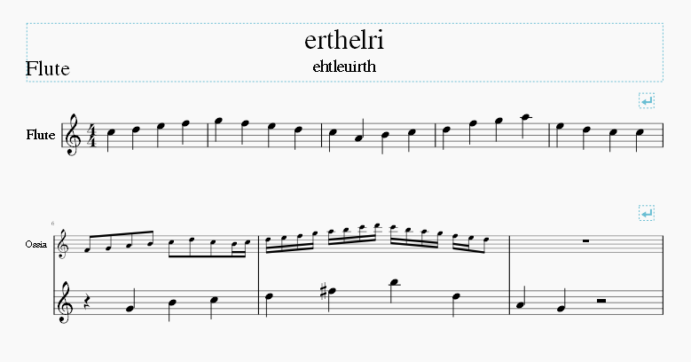

1. 创建你的乐谱时，要为ossia增加一个额外的谱表(使用乐器对话框中的 "增加五线谱 "按钮，在同一乐器上增加额外的五线谱);
2. 正常输入所有的音符(包括为ossia的音符);
3. 如果需要的话，可以添加换行符，以使ossia适合;

4. 要把 ossia 谱表设置成比主琴谱更小的打印尺寸，在一个小节 (或乐器名称) 的空格上点击右键，选择 __谱表属性__。勾选标有 "缩小谱表" 的复选框 (你也可以在同一个对话框中把这个谱表的长、短乐器名称改为 "Ossia")；

5. 如果需要的话，对其他谱线使用 "永不隐藏 "选项;

6. 从主菜单中，选择 <samp class="menu">样式</samp>&rarr;<samp class="menuitem">常规...</samp>&rarr;<samp class="menuitem">乐谱</samp>。勾选  "隐藏空谱表". (如果有必要，还要清除 "即使谱表组为空也不隐藏" 的复选框);

7. 手动创建分谱;
8. 根据需要重新调整行节符，以纠正乐谱布局;

9. 如果需要的话，你可以选择没有音符的ossia谱表小节，让它们不可见。要做到这一点，在一个小节的空白处点击右键，选择  __小节属性__，取消该对话框中的“可见”复选框。

 结束前一小节的小节线将保持可见，但结束所选小节的小节线则不可见。如果需要，你可以通过选择一个单独的小节线并按 <kbd><kbd>V</kbd></kbd>来使其不可见。

你可以根据需要延长小节线，使其跨谱表。选择你想延长的小节线，并在检视器中指定要跨越的谱表数量。

如果需要的话，你可以用通常的方式在ossia谱表中添加谱表文本。

### 另请参阅

* [node:46226,title="如何使用截图来创建一个ossia谱表"]
