介绍
------------

_重要提示:本教程最初是为MuseScore 2.0创建的。文本和截图已经更新，以反映MuseScore 3的当前版本。_

### Modified Stave Notation

改良五线谱记谱法(MSN)是“描述大字体音乐的术语”。MSN扩大了音乐的范围，使音乐更加一致，但它也改变了音乐的比例。音符间距调整，其他特征，如发音和表情符号可能会不成比例地扩大。”来源：创建清晰打印和大型打印文件：2012年 [UKAAF G003指南 第60页](https://www.ukaaf.org/wp-content/uploads/G003-UKAAF-Creating-clear-print-and-large-print-documents.pdf)。UKAAF文件中概述了一些需要考虑的基本参数。英国皇家音乐学院联合委员会(ABRSM)和三一学院(Trinity)等器乐和声乐等级考试委员会，如果要求使用MSN，就会使用五线谱。此外，在英格兰和威尔士，一般的音乐考试中，如果有特殊类型的阅读障碍或部分视力障碍的考生需要修改印刷版试卷，就会使用MSN。

### MuseScore

MuseScore是领先的免费开源音乐记谱法软件。它在世界各地被用来制作雕刻精美的乐谱。有了MuseScore，人们可以在许多方面修改乐谱。本文档将展示如何使用MuseScore来产生MSN乐谱。

使用MuseScore创建MSN
-------------------------

### 谱表尺寸

在 MuseScore 中创建 MSN 记谱法乐谱时，要做的第一件事是选择一个使读者感到舒适的员工大小。要更改分数的人员规模，请转到**格式&rarr;页面设置**。在缩放比例部分中，您可以更改模板谱表间距（有时简称为"spatium"或"sp"）。1 空间是正常谱表的相邻线之间的距离（以毫米（或英寸为单位）。如果增加该值，然后按**应用**按钮，您将看到您的乐谱将显示得更大。当您对音乐的大小感到满意时，请按**OK**以验证您的选择。

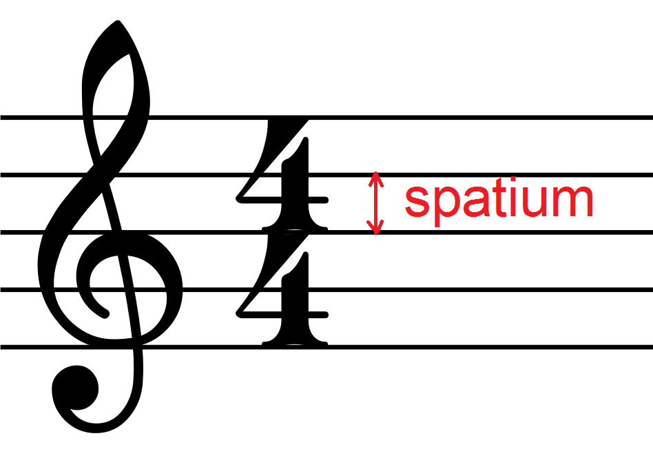

间距是乐谱大部分元素的基本单位。增加间距会增加谱表尺寸，但也会增加音符头、谱号、调号以及五线谱上的每个元素的大小。然后，它可能会改变乐谱的布局，引入新的系统分隔符，改变分页符，还可能导致音符、文本和圆滑线之间的冲突。本文的下一段将帮助您解决这个问题。继续读下去。

### 纸张大小和方向

在同一对话框**格式&rarr;页面设置**中，可以选择**页面大小**和**方向**。对话框底部的预览将让您了解乐谱布局。

选择方向是一个品味问题。 对于一些（乐谱）横向是理想的； 它允许更长的系统并且它们的数量更少，这使得寻找下一个系统变得不那么麻烦。 它还使得硬拷贝更容易被搁置，并在视野中包含更多内容。 对于其他人来说纵向更合适，或者至少更熟悉。 借助特殊的夹式灯，在黑暗的场所照明也可能更容易。

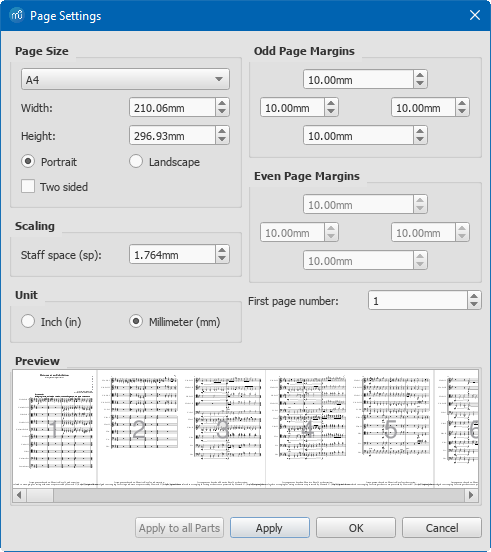 

您还可以在此对话框中更改页边距。减少边距是增加每页音乐量的简单方法。检查页面大小旁边的双页对开，偶数页和奇数页的页边距将被镜像。如果要打印和绑定生成的乐谱，并且可以根据所使用的绑定的类型和大小调整边距，这将非常方便。

### 手动调整

MuseScore中的大多数元素都可以手动移动。如果您需要移动文本、临时记号或奏法记号，只需选择它并将其拖放到其他位置即可。如果按 Ctrl，则可以限制水平拖动;如果按 Shift，则可以垂直限制拖动。也可以使用键盘轻推非文本元素。双击某个元素，然后使用键盘上的箭头键将其微移 1/10 的间距。Ctrl + 箭头会将元素移动 1 个间距。Alt + 箭头会将其移动 1/100 的间距。对于文本元素，只需选择它们并使用箭头键即可。您也可以使用**检视器**。选择一个或多个元素，在**视图→检视器**中，您可以更改 **X 偏移** 和 **Y 偏移**，以分别水平和垂直移动元素。

### 谱线粗细

有些用户可能会觉得五线谱太细或者太粗。很容易改变五线谱的粗细。转到**格式→样式→小节**(英国英语：**Bar**)并更改谱线粗细。请注意，谱线宽度以谱线距单位表示，因此增加谱线距将按比例增加五线谱线的厚度。

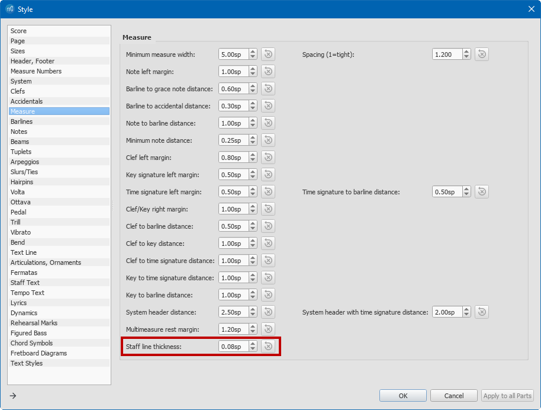 

### 小节线粗细

增加小节线的厚度可以更容易定位小节边界。您可以在**格式→样式→ 小节线→细小节线粗细**中更改小节线的厚度。该对话框包含其他要考虑的参数。**粗小节线粗细**将改变开始重复、结束重复或最终小节线线中最厚的线条，而**粗小节线间距**将改变该线条与其旁边较细线条之间的距离。**双小节线粗细**和**双小节线间距**仅作用于双小节线，双小节线通常用于分隔一曲中的各个部分。

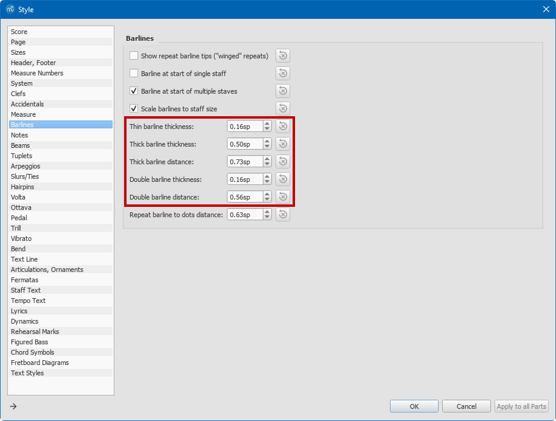 

### 音符符干粗细

可以在**格式→样式→音符→符干粗细**中改变音符干的粗细。

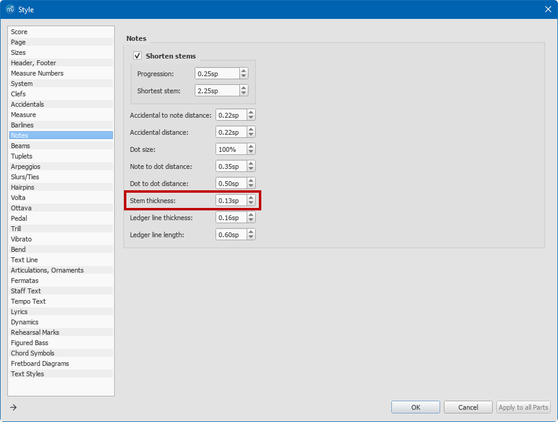 

### 音符间距

如果您觉得音符彼此靠得太近或太远，您可以改变MuseScore分隔音符的方式。转到**格式→样式→小节(UK: Bar)→间距**。默认值为1.2。如果您想在音乐中有更多的空间，请增加此参数。请注意，这可能会导致更多的系统崩溃。如果某些音符最终过于接近，您也可以修改**最小音符间距**。

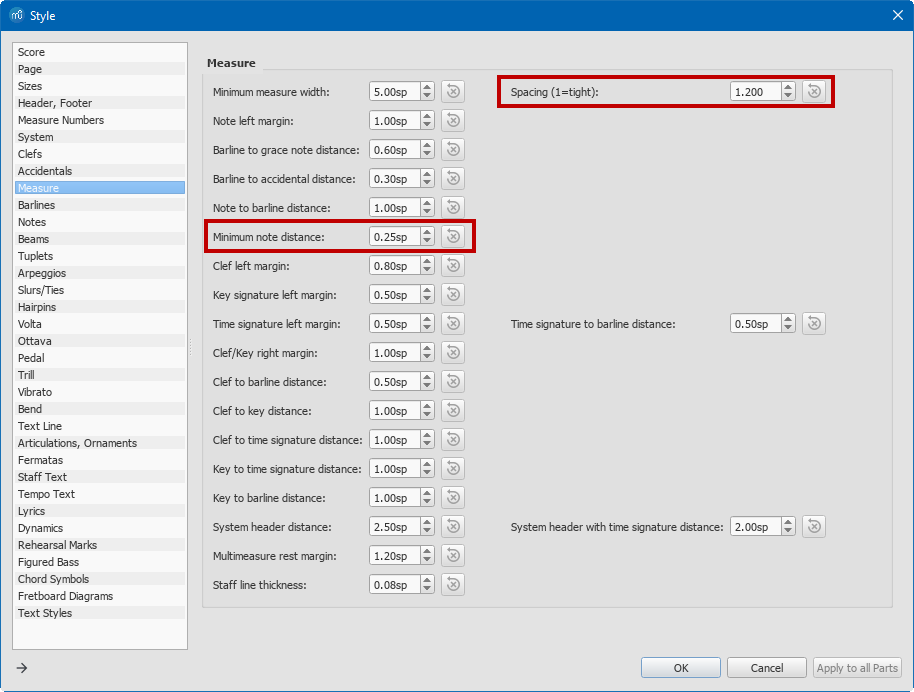 

开始检查在你关注的音符周围你能看到多少音符。当你把音符移动得更近时，你能看到的最大值是多少？在极少数情况下，您可能需要水平移动音符或和弦。例如，当您想要避免大和弦中音符和临时记号之间的碰撞时，这可能会很有用。

如果您想要移动一个完整的和弦或单个音符，请在和弦中选择一个音符，按F8或转到**视图→检视器**。在**检视器**中，转到**和弦**部分，并更改“水平偏移”以水平移动和弦。作为一种快捷键，您可以通过双击单个音符和弦并使用键盘上的**左右箭头键**来移动它。只有音符头会移动，但是当你在正确的位置时，点击其他地方，符干会与音符头连接。

### 增大附点（持续时间点）

持续时间点是否足够清晰？ 尝试将它们移近或远离音符。 尝试改变它们的大小。 MuseScore 允许您在**格式 → 样式 → 音符 → 附点大小**中更改附点大小。 您还可以通过**音符-附点间距**修改音符与它们的点之间的距离，您可以通过**样式 → 通用 → 音符 → 附点-附点间距**更改属于双点或三点音符的附点之间的距离。

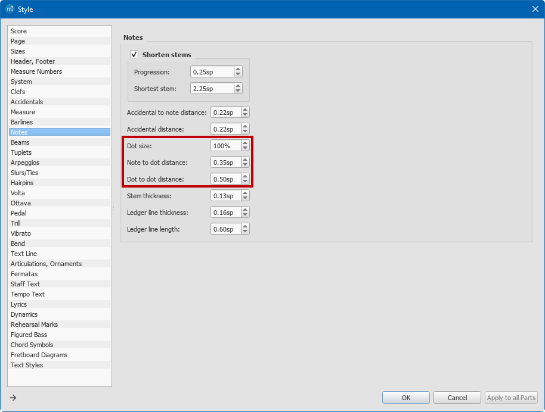 

### 加线

加线需要做得比你选择的谱线粗细厚吗？让它们比原来的更长会有帮助吗？您可以在**格式→样式→音符**中找到**加线粗细**和**加线长度**的设置。

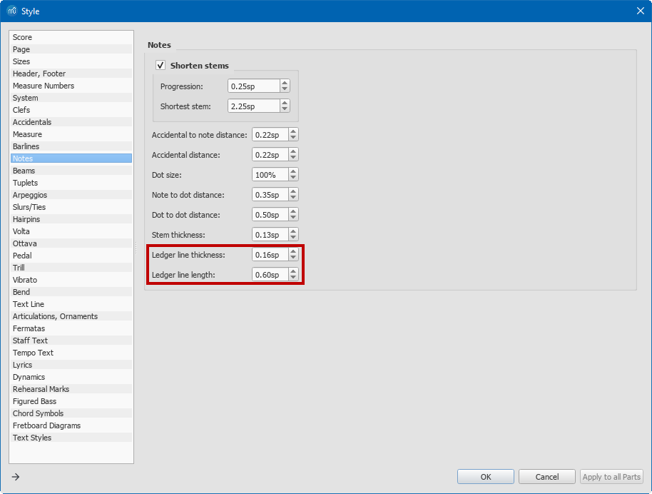 

### 符杠

会有助于使符杠变粗吗？您可以在**格式→样式→符杠→符杠粗细**中执行此操作。您可能会发现您也需要更改**符杠间距**，但请注意，它与**符杠粗细**成比例。

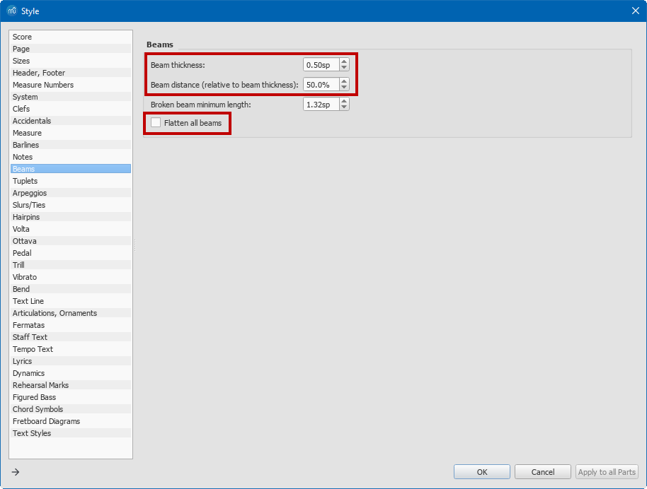 

让符杠总是平行于五线谱而不是跟随旋律的方向会有帮助吗？您可以通过**压平所有符杠**来实现这一点。它会使所有的符杠水平。但是，MuseScore允许您通过双击符杠并拖动蓝色手柄来自定义任何符杠坡度。即使选中了水平复选框，任何自定义都将保留。

提示：如果您有一些自定义符杠的乐谱，并且当您将样式设置为“压平所有符杠”时，有些符杠没有展平，请右键单击任何符杠→**选择→所有相似元素**，然后按Ctrl + R (macOS: Cmd + R)重置所有选定梁的符杠坡度和高度。

在中间一行翻转一些音符符杠(或者如果你不介意打破规则的话，确实在其他地方)会有帮助吗，这样一个段落中的所有符杠都向上或向下？只需选择符杠组或符杠本身的音符，然后按键盘上的X键。您也可以使用工具栏按钮“翻转方向”来执行此操作。请注意，此动作也可用于翻转连音括号、速度文本和圆滑线。

### 圆滑线和延音线

更粗的圆滑线和延音线会有帮助吗?圆滑线和延音线的外观可以在**格式→样式→圆滑线/延音线**中进行修改。圆滑线和延音线被绘制成两条曲线，在连音线的顶部和底部。**连音线端点粗细**将改变线条末端的宽度。**连音线中部粗细**会改变两条曲线之间的距离，在中间形成模糊。虚线和虚圆滑线是用一条曲线绘制的。您可以在**虚线粗细**中更改此曲线的厚度。

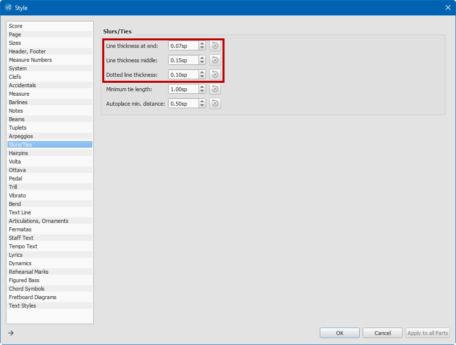 

如果把它们放在谱表外面会不会好一点?圆滑线有时可能会与配乐中的其他元素发生冲突。您可能还想改变一个圆滑线的形状，使其更明显，并将其放置在谱表之外。您可以通过双击圆滑线并拖动蓝色锚点来做到这一点。单击其他地方退出此圆滑线的编辑模式。目前还没有办法一次修改所有的圆滑线。

### 奏法记号

总的来说，MSN比普通五线谱更努力地避免符号重叠。所以有时候，比如说，让断奏的点都平行于五线谱，但在五线谱之外，比出现在五线谱中的点跟随旋律线更有帮助。如果音符有断奏音符或持续标记或重音，将这些音符放在五线谱外与五线谱平行的一条线上会有帮助吗，还是它们更好地跟随五线谱内外的旋律？他们需要更大和/或更接近他们的音符吗？在**格式→样式→奏法记号→奏法记号大小**中，您可以设置整个乐谱的奏法记号大小。您需要输入标准尺寸的百分比。I

根据符干方向，奏法记号会自动放置在和弦上方或下方。 您可以通过**检视器**面板为单个奏法记号覆盖此设置。 在乐谱中选择一个或多个奏法记号并转到**视图 → 检视器** (F8)。 一些奏法记号，例如延音号，有一个名为**置于**的选项，可以是“上方”或“下方”。 其他人有一个名为**定位点**的选项，可以相对于五线谱或和弦进行设置。 定位点在五线谱上的运音法总是出现在五线谱之外，而定位点定在和弦上的奏法记号会显得离五线谱更近，甚至可能侵占它。

_固定在谱表顶部的正常尺寸奏法记号_
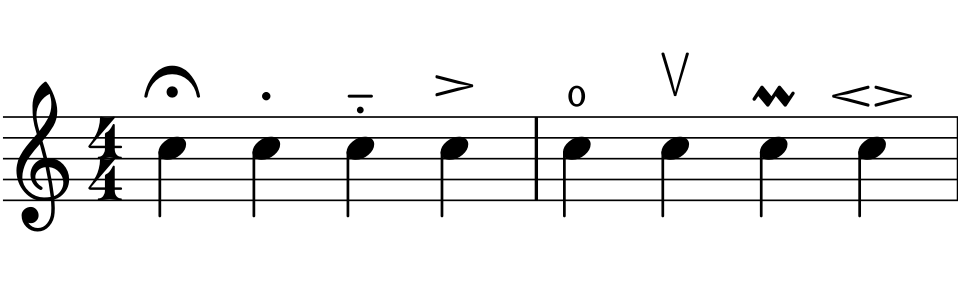

_尺寸为150%的奏法记号固定在谱表顶部_
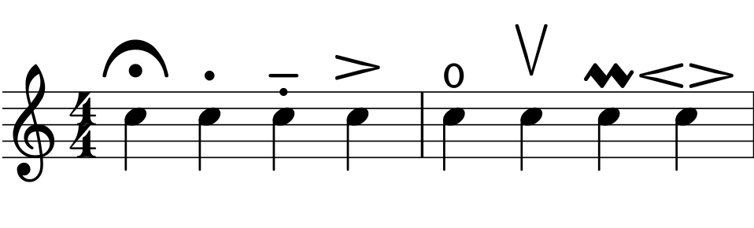

### 临时记号

临时记号，尤其是自然和尖锐标志之间的区别，够清楚了吗？需要把它们移近音符吗？您可以在**格式&rarr;样式&rarr;音符&rarr;临时记号-音符间距**中更改整个乐谱的临时记号和音符之间的距离。使用**临时记号间距**来更改和弦中临时记号元素之间的距离。如果你想改变一个特定临时记号的位置，只需双击它，并使用左右箭头键移动它。

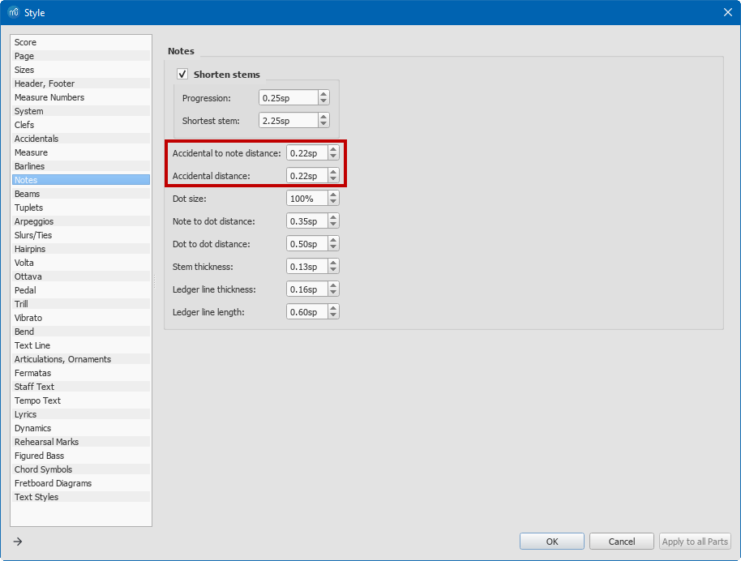 

### 渐变记号

线条会更粗吗？他们能更广泛地支持吗？它们最好放在哪里？请注意，渐变记号的位置差异很大。渐变记号外观可以在**格式&rarr;样式&rarr;渐变记号**中更改。默认的垂直位置定义了渐变记号离谱表有多近。渐变记号线将以给定的**线条粗细**绘制，您可以使用**高度**参数控制渐变记号的打开程度。如果一个渐变记号横跨几个系统，MuseScore会在系统结束时自动切断它。**持续高度**参数定义了系统分隔符处渐变记号的高度。

### 括号, 八度线

考虑用于第一间和第二间小节的线条，用于八度视奏的虚线等。用粗线做这些会有帮助吗？你能把它们放在更容易找到的地方吗？有一个简短的系统来突出它们会有所帮助吗？让他们永远处于系统的末端是否会有所帮助？括号和八度线外观可以分别在**格式 &rarr; 样式 &rarr; 八度线** 和 **格式 &rarr; 样式 &rarr; 括号**中对整张乐谱进行控制。

### 颜色

乐谱中的大多数非文本元素可以具有自定义的颜色。要更改元素的颜色，请选择它并转到**视图&rarr;检视器**。在**检视器**的**元素**部分，点按颜色框并选取一种颜色。要给文本元素着色，请参见下面的“文本和文本样式”。

### 文本 & 文本样式

一个乐谱包含不同类型的文本元素：力度、速度记号、指法、标题、作曲家等。有些元素的风格需要专门的解释，下面将进一步解释。然而，文本处理有一些共同的特征。在MuseScore中，每个文本元素都可以被样式化或非样式化。你可以通过**检视器**(**视图&rarr;检视器**，F8)选择文本的样式。每个样式化的文本将遵守文本样式参数，而你可以为每个未样式化的文本定义字体、大小、颜色等。每个文本类型都有一个预定义的文本样式，您可以在**格式&rarr;样式&rarr;文本样式**中编辑它。在左边，你会看到一个样式列表，点击其中一个来编辑它。当你按下**OK**键时，这个对话框中的任何改变都会影响到所有具有给定样式的文本元素。

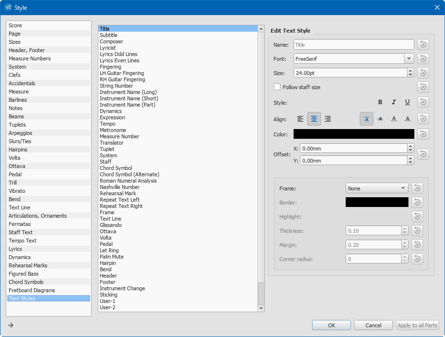 

对于每种样式，您可以更改：

*   字体：字体、字号、字体样式(粗体、斜体、下划线)。请注意，如果需要，字体大小可以用间隔单位表示。在这种情况下，如果您更改间隔，这种样式的文本将会缩放。默认情况下，五线谱上的文字(速度、表情等)与间隔单位成正比，而页面上的文字(标题、页码等)则不成正比。请注意，样式化的文本不能混合不同的字体或字号。
*   颜色：点击矩形并选择一种颜色
<!--*   System flag: If this checkbox is ticked, the text will be exported to all the staves when you extract the parts from the main score.-->
*   垂直和水平对齐：这对于占位框中的文本尤其有用，例如标题、作曲家等。您可以选择它们在占位框中如何垂直和水平对齐。位置。您可以为给定的样式定义水平和垂直偏移。这些偏移量可以与间隔单位成比例，也可以是绝对的，单位为毫米。相对偏移量对于附加到框架占位框的文本(标题、作曲家等)很有用，并且是占位框高度或宽度的百分比。
*   占位框：文本可以放在占位框中。 勾选占位框复选框并选择占位框的粗细、边距、是否希望它是圆形或矩形，以及矩形是否应该是圆角的。 您还可以选择制作占位框的颜色和文本背景的颜色。

### 指法

是否有指法、和声符号、停止音符符号或任何其他与音符相关的小字？如果有，应该放大到什么尺寸，放在哪里最好？指法本身是一个完整的主题，尤其是对于吉他手来说，可能有两套指法，每只手一套，再加上关于弹奏哪些弦乐音符的信息。指法在MuseScore中被视为文本。您可以在**格式&rarr;样式&rarr;文本样式&rarr;指法**中更改大小、字体、颜色和其他指法参数。请记住，您可以通过点击指法并使用箭头键或检视器来移动它们。

### 力度

Arial字体会比花哨的音乐 **_f_** 和 **_p_** 以及其他基于字母的力度更容易吗？ 或者与速度记号或歌词相比，让它们更容易被发现会更好吗？ 你希望它们多大？ 让它们尽可能靠近五线谱是否更清晰？ 如果在他们应用的五线谱之上或之下，它们更容易被找到吗？ 力度记号文本可以通过**格式&rarr;样式&rarr;文本样式&rarr;力度记号**样式化。 您可以更改字体、大小、颜色等……乐谱中的任何文本都可以编辑。 如果你想用普通字母改变一个花哨的 **_mf_** ，你可以双击它，删除文本，如果你愿意，可以用 sans serif字体输入 mf。 目前无法一次将所有动态从花哨字体更改为普通脚本字体。 样式化的 **_p, m, f, z_** 与实际字母不同，因此更改字体可能会显示无意义的字符。

### 歌词

在谱表和其他主歌中只放一组文字作为音乐之后的诗歌，并带有任何改变的省略号下划线，会更容易吗？文本是否更容易在模板上方或下方理解？什么字体和粗体最好？通常，在添加歌词时，整个音乐布局会发生变化，因此请在更改歌词文本后检查音符的间距。是否需要妥协？可以在**格式&rarr;样式&rarr;文本样式&rarr;奇数行歌词**和**偶数行歌词**中修改歌词的字体和大小。如前所述，它们将分别更改奇数和偶数歌词行的属性。MuseScore在谱表下方显示歌词。如果要显示上面的歌词，可以将水平偏移量属性更改为负数。如果要在乐谱之后显示歌词，则需要删除乐谱中的歌词（如果有）。可以使用标准快捷键（按住 Ctrl + 单击或Shift + 单击以选择），然后按 Del。然后，您可以在乐谱末尾的专用占位框中输入歌词。转到**添加&rarr;占位框&rarr;追加垂直占位框**。右键单击插入的占位框，**添加&rarr;文本**，然后开始键入歌词。

### 谱表和页面布局

如上所述，这可能适用于除了最短的音乐片段之外的所有音乐片段，对于打印在纸上的每一段音乐都必须手动完成。在MuseScore中，您可以通过选择一条小节线并按Return键来断开行。也可以将行节符从**行节符与空位符**选项板拖放到小节中。在这个给定的小节后，它会破裂。分页符也是如此。您可能还需要在行中强制实施一些措施。您可以在行的第一个小节之前和最后一个小节之后放置一个换行符。然后你需要在这些小节中“压缩音乐”，使它们适合页面宽度。您可以通过选择小节并选择**格式→小节拉伸→缩减小节宽度**来实现。如果有必要，你可以少拉伸几次。但是，请注意，没有奇迹，您可能需要在可读间距和您希望音乐中断的位置之间做出一些让步。不仅在考虑符号及其位置和间距时，而且在音乐内容和布局之间的对应关系时，音乐更容易阅读。因此，一首十六小节长的乐曲通常被排列成四个四小节的乐句，每个乐句对应一行。MuseScore中有一个专用选项，可以在每X次小节时中断一个行。您可以选择一个音乐范围，方法是单击第一个音符，按住Shift键并单击最后一个音符，然后转到**格式→添加/删除换行符**。使用更多的重复和da capo标记可能有助于将放大的音乐保持在可管理的数量，并减少翻页。Da capo和其他音乐流控制标记可以在MuseScore的**重复与跳转**选项板中找到。它们可以通过拖放添加到乐谱中。每行的小节数比原始小节数多可能会有所帮助，这样重复的乐句就可以与第一次出现的乐句区分开来。MuseScore允许您在**格式→样式→小节号**中更改小节号的间隔。如果要显示每个小节的小节号，请选择“间隔”并输入值1。小节号的定位类似于**格式→样式→文本样式→小节号**中的其他文本。

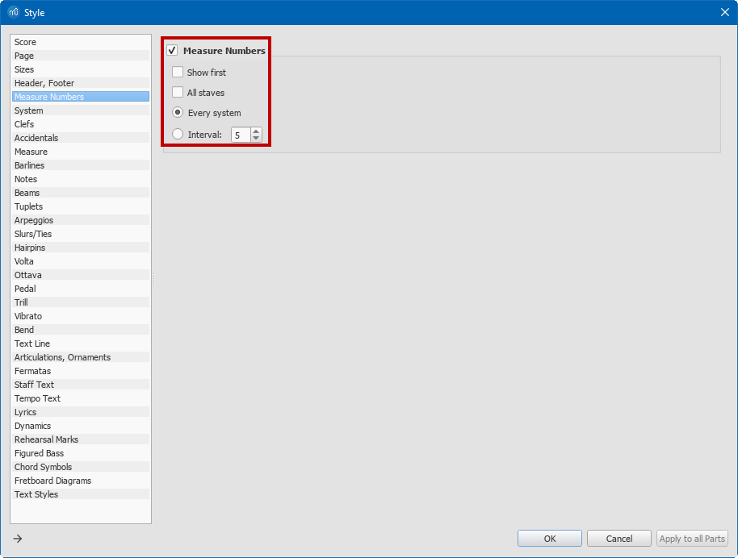 

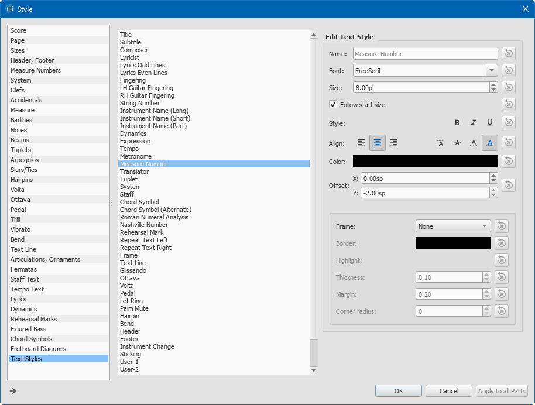 

关于乐曲结构的音符通常有助于鼓励学生意识到，当音乐重复时，他们必须做的记忆量会减少。仔细分析还可以看出音乐在哪些地方微妙地偏离了以前的类似素材。不要犹豫添加谱表文字(Ctrl + T)或排练记号(Ctrl + M)来突出音乐的结构或给出指示。这些也可以从菜单**添加→文本**中添加。在有很多休止符的音乐中，比如乐队部分，再次对休息期间发生的事情有所了解可以加速找到排练的正确位置。有几种方法可以指示其他部分发生了什么。如果这段音乐包含歌词，您可能希望在五线谱上方添加一段文字，向乐器演奏者指示歌手将在何时演唱。在MuseScore中，您可以向任何音符添加文本。选择一个音符或休止符，然后按Ctrl + T。然后输入文本并单击其他地方。然后，您可以拖放文本来重新定位它。如果你正在创作一首管弦乐作品，通常会添加提示音符。您可以将提示音符作为普通音符输入，然后通过在检视器(F8)的**和弦**部分中选择**缩小化和弦**来缩小它们。

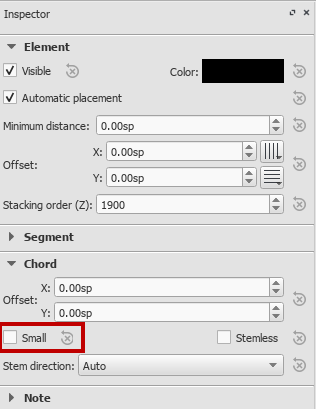 

保存你喜欢的样式
---------------------------

一旦您决定了所有相关的偏好设置，您将希望保存这些偏好设置，以将其应用于现有乐谱或创建具有相同偏好设置的新乐谱。然后你所需要做的就是组织分页符，从左到右检查密度，也许在一些谱表组中加入更多的小节，或者有更多的换行符。要保存您的偏好设置，您可以保存您的样式设置，并将其应用于导入的乐谱，或者您可以创建一个模板并使用它来创建新的乐谱。

### 保存和加载样式

MuseScore 让您在**格式&rarr;保存**样式中保存样式文件 (.mss)。 样式文件将从**样式**和**页面布局**对话框中捕获在**格式**菜单中完成的所有设置。 您可以在乐谱中加载样式文件，以根据您的 MSN 偏好设置快速更改其外观。 您只需要浏览乐谱并修复换行符和分页符，并最终修复冲突。 当您想要以 MSCZ 格式或 MuseScore 可以导入的各种格式调整现有乐谱时，样式也是完美的工具。 只需导入文件，应用您的风格，90% 的工作就完成了。

### 使用模板

如果你用MuseScore作曲或从纸上抄写，您可能更喜欢使用模板而不是样式文件。模板基本上是一个MuseScore文件，带有相关的样式、页面设置和乐器。如果您经常为SATB合唱团抄写，您可以为SATB创建乐谱，更改样式和页面设置，并将乐谱保存在MuseScore的模板文件夹中，无需任何音符。模板文件夹在**编辑&rarr;偏好设置&rarr;常规&rarr;模板**。重新启动MuseScore并创建新的乐谱。在新建乐谱向导中，选择从模板创建，并选择您新创建的模板。您已经准备好以MSN风格在乐谱中输入音符。

结论
----------

MuseScore的灵活性使您能够高效地创建MSN分数。从MuseScore 3.0版开始，多项功能将使此过程更加轻松。如果您正在使用MuseScore生成MSN分数，欢迎在MuseScore论坛上提供反馈，网址为： http://musescore.org/en/forum 或直接联系 http://musescore.com/contact 除了MuseScore软件，还有MuseScore社区，他们非常慷慨地分享他们与MuseScore一起创建的工作。例如，贝多芬的所有钢琴奏鸣曲都有MuseScore格式可供下载。将MSN样式应用于MuseScore文件，您就可以开始了。

附录
--------

迈克尔·托马斯·安德鲁（Michael Thomas Andrew）原创配乐《独白与小步舞曲》 [MAn final Solo for Bass Viol_musescore](../images/MAn%20final%20Solo%20for%20Bass%20Viol_musescore.pdf) MSN格式的相同乐谱 [MAn final Solo for Bass Viol_MSN](../images/MAn%20final%20Solo%20for%20Bass%20Viol_MSN.pdf) 视频制作: http://www.youtube.com/watch?v=RDFx8PZR46Y&hd=1 Rishi创建的较短MSN教程: [musescore msn tutorial](../images/musescore%20msn%20tutorial.docx)

许可证
-------

本文档由MuseScore.org在[知识共享协议](https://creativecommons.org/licenses/by/4.0/)下授权。请分享！