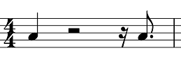
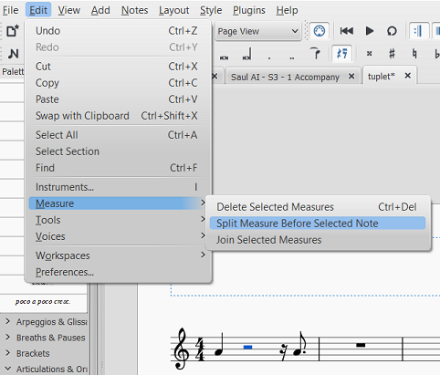
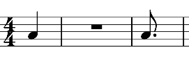
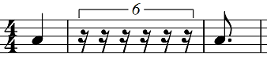
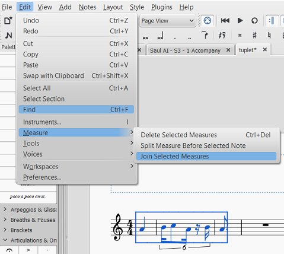
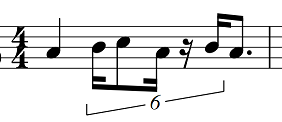

这解释了如何用通常不通过单个音符或休止符表达的时间长度制作连音。
在 MuseScore 中，要制作连音符，您必须输入单个音符或休止符并将其更改为连音符。 诸如九个 16 分音符之类的持续时间不能用单个音符来表示。 以下是解决此限制的方法：

1. 确定连音的总持续时间，并输入休止符来填充该时间。我用了一个音符来指示下一个音符或休止符将在哪里，但是如果你想的话，你可以用休止符。

2. 选择将启动组合的第一个休止符，并在菜单中选择**工具 &rarr; 小节 &rarr; 在所选音符/休止符前拆分小节**。
  

3. 选择连音后的音符或休止符，并在菜单中选择**工具 &rarr; 小节 &rarr; 在所选音符/休止符前拆分小节**,与上一步一样。
 

4. 你现在将有3个小节，而你之前有1个。中间的小节将有一个小节休止符。

5. 选择休止符，并像创建其他节点一样创建一个[node:36061,title="连音"]。

6. 把你想要的音符和休止符输入连音。

7. 选择您创建的所有三个小节，并使用菜单**工具 &rarr; 小节 &rarr; 合并所选小节**。

8. 您现在将在您想要的小节中拥有连音。
 

**注意**：当您拆分小节时，它将为同一行中的每个乐器拆分小节。 强烈建议在输入其他乐器的音符之前输入此类连音。 如果您必须在创建这些连音之前将音符输入到其他乐器中，您将需要找到其他乐器没有音符的小节。 在那里工作，然后将小节复制到其最终位置。 如果这样做，您需要在复制之前用任何音符和休止符填充连音。 MuseScore 中有一个错误会导致这些连音在复制后损坏。 粘贴它们后，您可能无法在最终位置正确编辑它们。