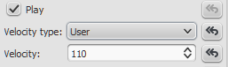

在MuseScore 2或3中打开MIDI文件后，力度不能工作。
打开MIDI文件后，您可能会发现力度、渐强和渐弱线不会像预期的那样影响播放。要解决这个问题：

1. 打开 (导入) [node:22918,title="MIDI"] 文件；
2. 如果检视器它还没有打开，打开 [node:38491,title="检视器"] (<kbd><kbd>F8</kbd></kbd> 或者“视图&rarr;检视器”) ；
3. 选择任何音符，然后右击并选择 "选择&rarr;选择全部相似元素";
4. 在检视器的 [node:278642,fragment="音符",title="音符"] 部分，找到“力度类型”和“力度”属性 (靠近底部) 。如:

5. 对于两个值，点击“重置为默认值”按钮。

这将重置所有的音符速度为MuseScore的默认值(即“偏移量”和0)，并恢复力度和渐变记号的正常播放。