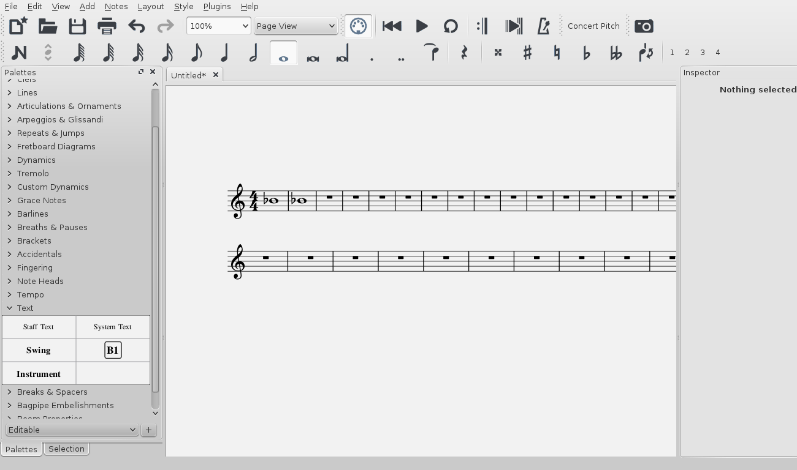

MuseScore 允许你在月品牌中途更改乐器音色。因此，您可以在arco，pizzicato和tremolo之间交替使用弦乐，或者将静音应用于小号，依此类推。 
下面的说明使用 __pizzicato strings__ 作为一个例子，但同样的原则适用于tremolo strings或muted trumpet。

1. 选择你想要pizzicato的部分的第一个音符；
2. 从菜单中选择 <samp class="menu">添加</samp> &rarr; <samp class="submenu">文本</samp>&rarr;<samp class="menuitem">谱表文本</samp>;
3. 键入 <kbd>pizz.</kbd> 。此时，五线谱文本是一个视觉参考，并没有在播放期间应用；
4. 右键单击谱表文本然后选择 <samp class="menuitem">谱表文本属性...</samp>;
5. 在谱表文本属性对话框中，选择左侧的一个或多个声部(在切换通道选项卡中)；
6. 从下拉菜单中选择 <samp>pizzicato</samp>

7. 点击 <kbd><samp>OK</samp></kbd> 回到乐谱。

在你添加的谱表文本后的每一个音符现在听起来pizzicato。要在乐曲的后面返回正常的弦乐声音，重复上面的一系列指令，但在步骤3键入 "arco," 在步骤 6 选择 <samp>普通</samp>.

#### 视频

