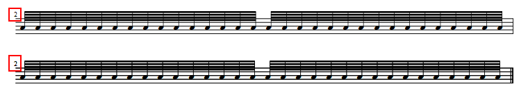

如果小节太长，无法适用于单个系统，那么解决方案就是在中间设置一个换行符。
<ol>
<li><strong>在您想要一分为二的小节之后创建一个空的小节：</strong>选择要分割的小节后的小节，并 <kbd><samp class="menu">添加</samp> → <samp class="submenu">小节</samp> → <samp class="submenu">插入小节</samp></kbd>，或按 <kbd><kbd>Ins</kbd></kbd>。如果它是乐谱中的最后一个小节，可以使用 <kbd><samp class="menu">添加</samp> → <samp class="submenu">小节</samp> → <samp class="submenu">附加小节</samp></kbd>，或者使用键盘 <kbd><kbd>Ctrl</kbd>+<kbd>B</kbd></kbd> (Mac: <kbd><kbd>⌘</kbd>+<kbd>B</kbd></kbd>)。</li>
<li><strong>将将进入新行的音符移动到新的空小节中：</strong>选择换行符位置后的所有音符，然后 <kbd><samp class="menu">编辑</samp> → <samp class="submenu">剪切</samp></kbd> 或按 <kbd><kbd>Ctrl</kbd>+<kbd>X</kbd></kbd> (Mac: <kbd><kbd>⌘</kbd>+<kbd>X</kbd></kbd>)。请确保您的选择涵盖了系统的所有部分。之后，选择第二个小节的所有面板， <kbd><samp class="menu">编辑</samp> → <samp class="submenu">粘贴</samp></kbd> 或按 <kbd><kbd>Ctrl</kbd>+<kbd>V</kbd></kbd> (Mac: <kbd><kbd>⌘</kbd>+<kbd>V</kbd></kbd>)。</li>
<li><strong>调整两种小节的实际小节长度：</strong>现在你必须删除两个小节末尾的休止符。在每个小节上，右键单击小节，小节属性…修改“实际长度”。例如，如果你在4/4的时间，并将一个四分之一长度的部分移动到第二小节，使第一小节的3/4和第二小节的实际持续时间为1/4。现在你必须删除两个小节末尾的休止符。在每个小节上，右键单击小节， <kbd><samp class="menu">小节属性...</samp></kbd> 修改 实际长度 。例如，如果你在4/4的时间，并将一个四分之一长度的部分移动到第二小节，使实际长度为第一小节3/4和第二小节1/4。
<li><strong>隐藏小节线：</strong>右键单击您的两个小节之间的小节线，并从菜单中 <kbd><samp class="menu">使它隐形</samp></kbd>  。</li>
<li><strong>如有必要，强制使用换行符：</strong>如果第二个小节仍然在与第一个小节相同的行上，则通过单击小节之间的小节线并按 <kbd><kbd>Return</kbd></kbd> 选择它。您还可以将换行符从符号面板拖到小节线上。</li>
<li><strong>固定小节编号：</strong>右键单击新谱表和 <kbd><samp class="menu">小节属性...</samp></kbd> 上的小节。您可以在“调整小节号”字段中输入-1，这将为您的新小节提供与前一个相同的数字，但会使小节数字正常地显示在行前面。或者，您可以将其标记为“不规则的”，这也可以避免小节被计数为2，但不显示，小节数字，因此您可以自己创建一个小节数字—可能在使用文本字段 (<kbd><kbd>Ctrl</kbd>+<kbd>T</kbd></kbd>)的括号中。</li>
</ol>