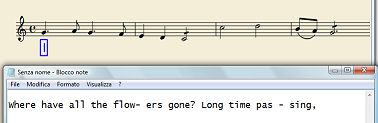
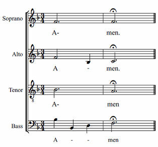

或者在乐谱修改后重新插入它们
1. 使用文字处理器(甚至记事本也足够了)将文本分成音节来排列。键入音节，后跟破折号 <kbd><kbd>-</kbd></kbd> 然后键入  <kbd><kbd>Space</kbd></kbd>；如果你的歌词是英文的，你可以用[这个工具](http://juiciobrennan.com/hyphenator/) 来自动化这个过程。
2. 复制，像往常一样，用 <kbd><kbd>Ctrl</kbd>+<kbd>C</kbd></kbd>(Mac: <kbd><kbd>Cmd</kbd>+<kbd>C</kbd></kbd>)；
3. 选择第一个音符，按 <kbd><kbd>Ctrl</kbd>+<kbd>L</kbd></kbd> (Mac: <kbd><kbd>Cmd</kbd>+<kbd>L</kbd></kbd>)进入歌词模式；
4. 按住 <kbd><kbd>Ctrl</kbd>+<kbd>V</kbd></kbd> (Mac: <kbd><kbd>Cmd</kbd>+<kbd>V</kbd></kbd>)。连续按下“V”：每次按“V”就会释放一个音节；
5. 注: 如果需要跳过某个音符，松开 <kbd><kbd>Ctrl</kbd></kbd>键，使用 <kbd><kbd>Space</kbd></kbd> 键切换到下一个音符，重复步骤3。

    如下图所示，实现破折号的正确位置
    

    我们键入：

    1. Soprano（女高音声部）
        A <kbd><kbd>Alt</kbd>+<kbd>-</kbd></kbd>, <kbd><kbd>Space</kbd></kbd> men. 键组合在第一个音节旁边留下破折号；

    2. Alto（女低音声部）
        A <kbd><kbd>-</kbd></kbd> men. 破折号将放置在第一个音节和第二个音节之间的中间（melisma）。为正确居中，按 <kbd><kbd>Ctrl</kbd>+<kbd>Alt</kbd>+<kbd>-</kbd></kbd>. 破折号将位于下一个音符的下方；

    3. Bass（男低音声部）
        A <kbd><kbd>Space</kbd></kbd>, <kbd><kbd>Ctrl</kbd>+<kbd>Alt</kbd>+<kbd>-</kbd></kbd> men. 为正确居中，输入A后按<kbd><kbd>Ctrl</kbd>+<kbd>Alt</kbd>+<kbd>- </kbd></kbd> 添加下括号，再按<kbd><kbd>Space</kbd></kbd>，继续输入<kbd>- </kbd> <kbd>- </kbd> men，最后删除下括号。破折号将位于中间每个音符的下方。

自动断字的**外部链接** ：

* https://juiciobrennan.com/hyphenator/
* http://www.sillabare.it/divisione-in-sillabe/divisione-in-sillabe.php