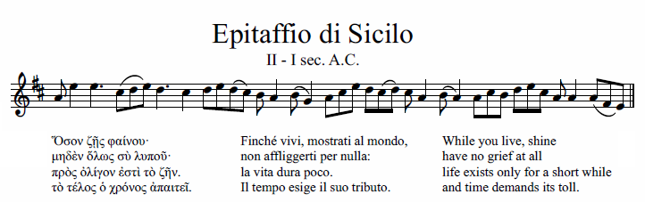
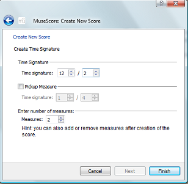
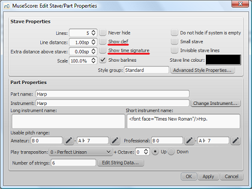

用于十四世纪的音乐和其他场合。

<ol>

<li>通过在对话框“创建新乐谱”中设置所需的值(上例中为12/2)和至少两个小节来创建新乐谱

</li>

<li>从第二小节开始输入音符</li>

<li>高亮显示第一小节然后按 <kbd><kbd>Ctrl</kbd>+<kbd>Del</kbd></kbd>, 或从菜单中选择 <kbd><samp class="menu">编辑</samp> → <samp class="menuitem">删除选中小节</samp></kbd>

完成了!</li>

</ol>

<strong>用 2.x 版本</strong>

<ol>

<li>单击高亮显示该小节然后按 <kbd><kbd>Del</kbd></kbd> 或者取消选中下图中的相应框

<li>右键高亮显示第一小节，选择谱表属性然后取消勾选显示谱号

</li>

</ol>
