Introduction
------------

_Important note: This tutorial was originally created for MuseScore 2.0. The text and the screenshots have been updated to reflect the current version of MuseScore 3._

### Modified Stave Notation

Modified Stave Notation (MSN) is "A term given to describe music in large print. MSN enlarges the music generally and makes a score more consistent, but it also alters the proportions involved. The spacing of notes is adjusted and other features such as articulations and expression marks may be disproportionately enlarged." Source: Creating clear print and large print documents: [Guidance from UKAAF G003 page 60](https://www.ukaaf.org/wp-content/uploads/G003-UKAAF-Creating-clear-print-and-large-print-documents.pdf), 2012. Some basic parameters to consider are outlined in the UKAAF document. Instrumental and vocal grade examination boards such as the Associated Board of the Royal Schools of Music (ABRSM) and Trinity present stave notation when requested as MSN. In addition in England and Wales, general music examinations use MSN when Modified Print papers are requested for candidates with particular types of dyslexia or partial sight.

### MuseScore

MuseScore is the leading free and open source music notation software. It is used all around the world to produce easily beautifully engraved sheet music. With MuseScore one can modify the score in many aspects. This document will show how MuseScore can be used to produce MSN scores.

Create MSN with MuseScore
-------------------------

### Staff size

The first thing to do when creating MSN notation in MuseScore is to choose a staff size that will make the reader comfortable. To change the staff size on a score, go to **Format → Page Settings**. In the Scaling section, you can change the stave space unit (sometimes called "spatium" or "sp" for short). 1 spatium is the distance in mm (or inches) between adjacent lines of a normal staff. If you increase the value, and press the **Apply** button, you will see that your score will be displayed bigger. When you feel comfortable with the size of the music, press **OK** to validate your choice.

The spatium is the base unit of most of the elements of the score. Increasing the spatium will increase the staff size, but also the size of noteheads, clef, key signature, every element attached to the staff. It may then change the layout of the score, introduce new system breaks, change the page breaks, it also may causes collisions between notes, text and slurs. The next paragraph in this document will help you fix that. Read on.

### Paper size and orientation

In the same dialog, **Format → Page Settings**, you can choose the **Page Size** and **Orientation**. The preview on the bottom of the dialog will give you an idea of the score layout.

Choosing orientation is a matter of taste. For some landscape is ideal; it allows for longer systems and they are fewer in number, which makes finding the next system less of a hassle. It also makes the hard copy stay on a stand more easily and includes more in the visual field. For others portrait is more suitable, or at least more familiar. It may also be easier to illuminate in a darkened venue, with the aid of a special clip-on light.
 
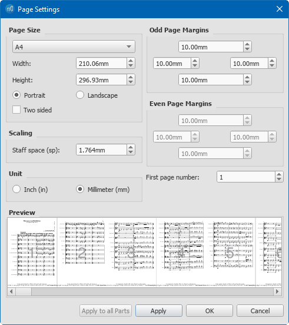

You can also change the margins of the pages in this dialog. Decreasing the margins is an easy way to increase the amount of music per page. Check two-sided next to the paper size and the margins for even and odd pages will be mirrored. This is convenient if you want to print and bind the resulting score and you can adapt the margins to type and size of binding you are using.

### Manual Adjustments

Most of the elements in MuseScore can be moved manually. If you need to move an item of text, accidental, or articulation, just select it and drag-and-drop it somewhere else. You can limit the dragging horizontally if you press Ctrl and vertically if you press Shift. Non textual elements can also be nudged with the keyboard. Double click an element and use the arrow keys on the keyboard to nudge it by 1/10 of spatium. Ctrl + arrow will move an element by 1 spatium. And Alt + arrow will move it by 1/100 of spatium. For text elements, just select them and use the arrow keys. You can also use the **Inspector**. Select one or more element and in the **View → Inspector** you can change **X offset** and **Y offset** to move elements horizontally and vertically respectively.

### Staff line thickness

Some users may find the staff line too thin or too thick. It is easy to change the thickness of the staff lines. Go to **Format → Style → Measure** (UK English: **Bar**) and change the Staff line thickness. Note that the staff line width is expressed in spatium units, so increasing the spatium will increase the thickness of the staff lines proportionally.

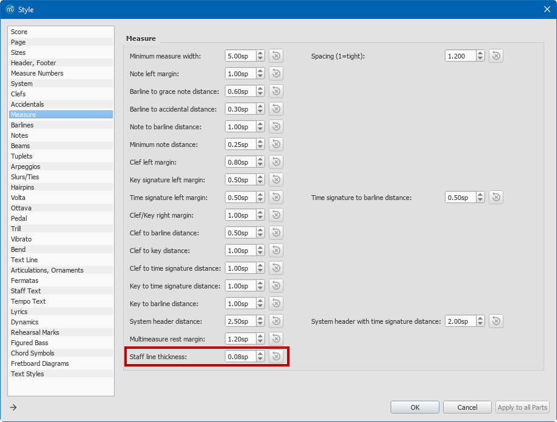

### Barline thickness

Increasing the thickness of the barline can make it easier to locate the measure boundaries. You can change the thickness of barline in **Format → Style → Barlines → Thin barline thickness**. This dialog contains other parameters to consider. **Thick barline thickness** will change the thickest line in a start repeat, end repeat, or final barline, while **Thick barline distance** will change the distance between this line and the thinner one next to it. **Double barline thickness** and **Double barline distance** act only on the double barlines, which are often used to separate sections in a piece.

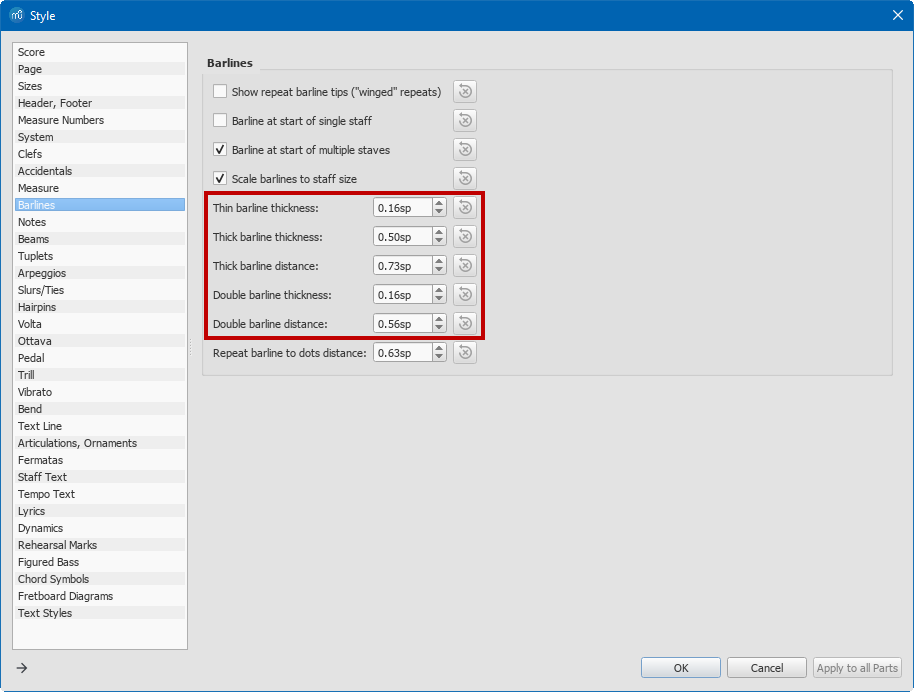

### Note stem thickness

The thickness of note stems can be changed in **Format → Style → Notes → Stem thickness**.

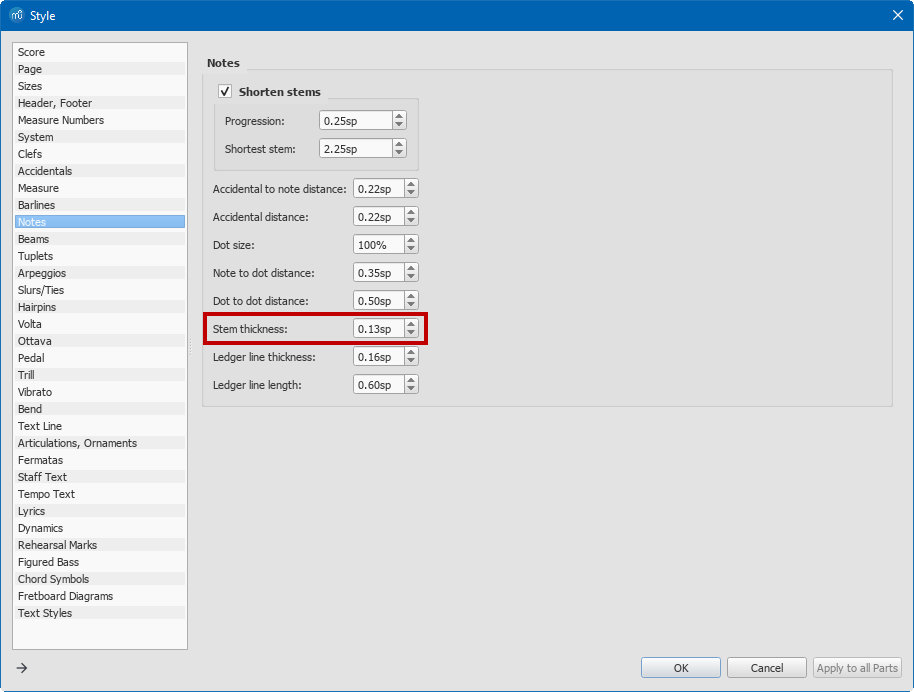

### Note spacing

If you feel the notes are too close to each other, or too far apart, you can alter the way MuseScore is spacing notes. Go to **Format → Style → Measure (UK: Bar) → Spacing**. The default value is 1.2. If you want more space in the music, increase this parameter. Note that it can result in more system breaks. If some notes ends up to be too close, you can also modify the **Minimum note distance**.

Begin to examine how many notes you can see around a note you focus on. What is the maximum you can see whilst still focussing on a central one, once you have moved the notes closer together? In rare occasions, you might need to move a note or a chord horizontally. It can be useful when you want to avoid a collision between a note and an accidental in a large chord for example.

If you want to move a full chord or a single note, select a note in the chord, press F8 or go to **View → Inspector**. In the **Inspector**, go to the **Chord** section and change Horizontal offset to move the chord horizontally. As a shortcut, you can move a single note chord by double clicking it and use the **Left and Right arrow keys** on your keyboard. Only the notehead will move but when you are at the right position, click somewhere else and the stem will join the notehead.

### Augmentation dots (duration dots)

Are duration dots clear enough? Experiment with moving them closer or further away from their note. Experiment with altering their size. MuseScore lets you change the dot size in **Format → Style → Notes → Dot size**. You can also modify the distance between notes and their dots with **Note Dot distance**, and you can change the distance between the dots belonging to double-dotted or triple-dotted notes with **Style → General → Note → Dot Dot distance**.
 

### Ledger lines

Do ledger lines need to be made thicker than the stave thickness you have selected? Would it help to make them longer than in the original? You can find the settings for  **Ledger lines thickness** and **Ledger lines length** in **Format → Style → Notes**.
 
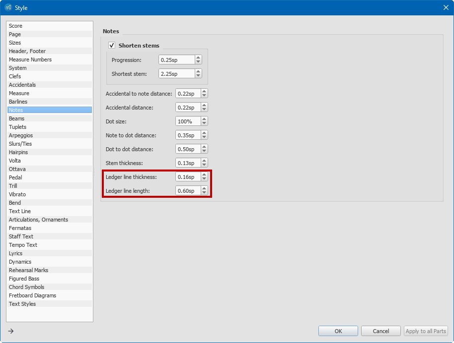

### Beams

Would it help to make beams thicker? You can do this in **Format → Style → Beams → Beam thickness**. You may find you need to change the **Beam distance** too, but note that it is proportional to **Beam thickness**.
 
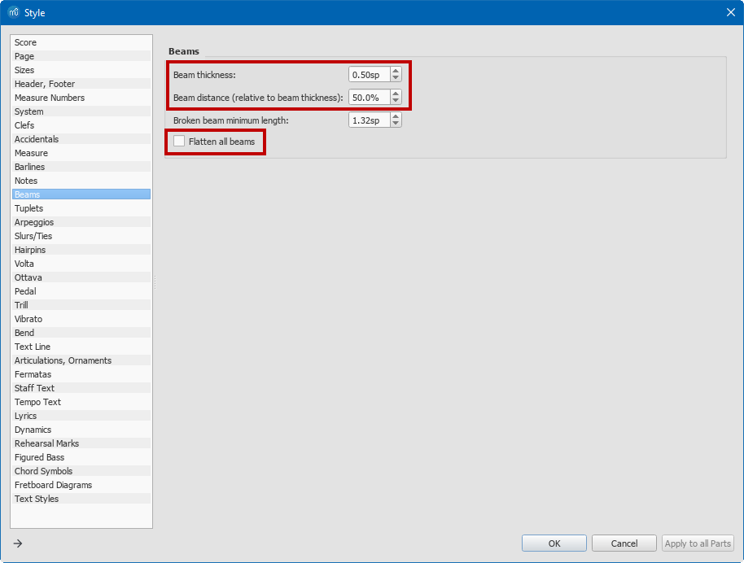

Would it help to have the beams always parallel to the stave rather than following the direction of the melody? You can achieve this with **Flatten all beams**. It will make all the beams horizontal. However, MuseScore lets you customise any beam slope by double clicking the beam and dragging the blue handles. Any customisation will remain even if the Horizontal checkbox is checked.

Tip: if you have a score with some customised beams, and some are not flattened when you set the style to “Flatten all beams”, right click any beam → **Select → All similar elements** and press Ctrl + R (macOS: Cmd + R) to reset the beam slope and height for all selected beams.

Would it help to flip some note stems on the middle line (or indeed elsewhere if you don't mind breaking the rules) so that all the stems in a passage all go up or down? Just select a note of the beam group, or the beam itself, and press the X key on your keyboard. You can also use the toolbar button “Flip” to do this action. Note that this action can also be used to flip tuplet brackets, tempo text and slurs.

### Slurs and Ties

Would thicker slurs and ties help? The appearance of slurs and ties can be modified in **Format → Style → Slurs/Ties**. Slurs and ties are drawn with two curves, at the top and the bottom of the slur. **Line thickness at end** will change the width of the extremities of the slur lines. **Line thickness middle** will change the distance between the two curves in the middle of the slur. Dotted and dashed slurs are drawn with one curve only. You can change the thickness of this curve in **Dotted line thickness**.

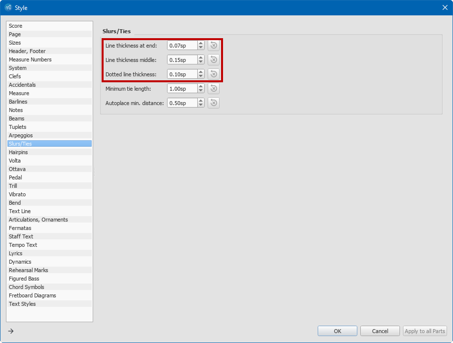

Would it help if these were placed outside the stave? Slurs might occasionally collide with other elements in the score. You might also want to change the shape of a slur to make it more visible and place it outside of the staff. You can do so by double clicking the slur and dragging the blue anchors. Click somewhere else to exit the edit mode for this slur. There is currently no way to modify all the slurs at once.

### Articulations

In general, MSN tries even harder than ordinary stave notation to avoid signs overlapping. So sometimes having, say, staccato dots all parallel to the stave but out of it is more helpful than dots appearing in the stave following the melodic line. If the notes have staccato notes or tenuto markings or accents, would it be helpful to have these outside the stave in a line parallel to the stave, or do they better follow the melody in and out of the stave? Do they need to be larger and/or closer to their notes? In **Format → Style → Articulations → Articulation size**, you can set the articulation size for the whole score. You need to enter a percentage of the standard size.

Articulations are automatically placed above or below the chord, depending on the stem direction. You can override this for individual articulations via the **Inspector** panel. Select one or more articulations in the score and go to **View → Inspector** (F8). A few articulations, such as fermatas, have an option called **Placement**, which can be "Above" or "Below". Others have an option called **Anchor**, which can be set relative to the staff or the chord. Articulations anchored to the staff will always appear outside the staff, while those anchored to the chord will appear closer to the staff and may even encroach it.

_Normal size articulations anchored to top of staff_

_Articulations with size 150% anchored to top of staff_

### Accidentals

Are accidentals, particularly the difference between a natural and sharp sign, clear enough? Do they need to be moved closer to the note? You can change the distance between the accidental and the note for the whole score in **Format → Style → Notes → Accidental to note distance**. Use **Accidental distance** to change the distance between acidentals within a chord. If you want to change the position of one particular accidental, just double click on it and use the Right and Left arrow keys to move it.

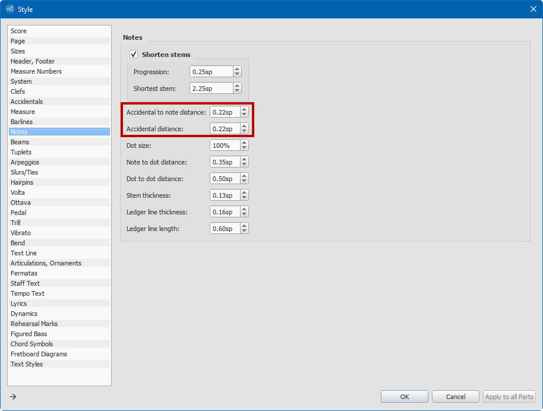

### Hairpins

Could the lines be thicker? Could they fan more broadly? Where are they best placed? Note that the placement of hairpins varies considerably. Harpin appearance can be changed in **Format → Style → Hairpins**. The default vertical position defines how close the hairpin will be from the staff. The hairpin lines will be drawn with the given **Line thickness** and you can control how open the hairpins are with the **Height** parameter. If a hairpin spans several systems, MuseScore will automatically cut it at the end of the a system. The **Continue height** parameter defines the height of the hairpin at a system break.

### Volta, Ottava

Consider lines used for first time and second time bars, dotted lines used for octave ossias, etc. Would it help to have these in thicker lines? Can you place them somewhere where they are easier to find? Might it help to have a short system to highlight them? Might it help to put them always at the end of a system. Volta and Ottava appearance can be controlled for the whole score in **Format → Style → Ottavas** and **Format → Style → Voltas** respectively.

### Colour

Most of the non text elements in a score can have a customized colour. To change the colour of an element, select it and go to **View → Inspector**. In the **Element** section of the **Inspector**, click on the colour box and pick a colour. To color text elements, see “Text & Text style” below.

### Text & Text style

A score contains text elements of different type: dynamics, tempo marking, fingerings, title, composer etc… The style of some elements requires a dedicated explanation and will be explained further below. However, text handling has some common characteristics. In MuseScore, each text element can be styled or unstyled. You can choose the style of a text via the **Inspector** (**View → Inspector**, F8). Every styled text will obey the text style parameters while you can define the font face, size, colour etc… for each unstyled text. Each text type has a predefined text style and you can edit it in **Format → Style → Text Styles**. On the left side, you will see a list of styles, click on one of them to edit it. Any change in this dialog will affect all the text elements with the given style when you press **OK**.

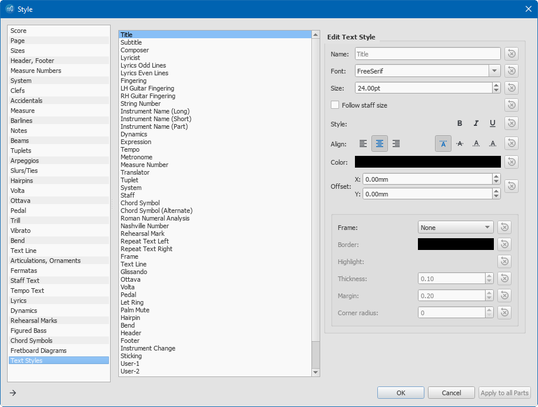

For each style, you can change the:

*   Font: The font face, the font size, the font style (bold, italic, underline). Note that the font size can be in spatium units if you want. In this case, the texts with this style will scale if you change the spatium value. By default, the texts attached to the staff (tempo, expression etc…) are proportional to the spatium while texts attached to the page (Title, page numbers etc…) are not. Note that a styled text cannot mix different font faces or font size.
*   Colour: Click on the rectangle and choose a colour
<!--*   System flag: If this checkbox is ticked, the text will be exported to all the staves when you extract the parts from the main score.-->
*   Vertical and horizontal alignments:This is particularly useful for text in a frame such as the title, composer etc… you can choose how they are vertically and horizontally aligned in the frame. The placement. You can define horizontal and vertical offsets for a given style. These offsets can be proportional to the spatium unit or absolute, in millimeters. The relative offsets are useful for text attached to a frame (title, composer etc…) and are percentages of the frame height or width.
*   Frame: Texts can be put in a frame. Tick the frame checkbox and choose the thickness of the frame, the margins, if you want it to be round or rectangle, and if the rectangle should be rounded. You can also choose to make the colour of the frame and the colour of the text background.

### Fingerings

Is there fingering, harmonic signs, stopped note signs or any other feature in very small print linked to the note? If so, what size should they be enlarged to and where is the best place to put them? Fingering is a whole subject of its own particularly for guitarists where there may be two sets of fingering, one for each hand, plus information about which strings notes are played on. Fingerings are considered as text in MuseScore. You can change the size, font face, colour and other fingering parameters in **Format → Style → Text Styles → Fingering**. Remember that you can move fingerings by clicking them and using the arrow keys or the inspector.

### Dynamics

Would Arial script be easier than the fancy music **_f_** and **_p_** and other letter based dynamics? Or would it be better to keep them as fancy to be more easily spotted in contrast to tempo markings or lyrics? How big would you like them? Is it clearer to have them as close to the stave as possible? Are they easier to find if above the stave to which they apply, or below? Dynamics text can be styled via **Format → Style → Text Styles → Dynamics**. You can change the font, the size, the colour etc... Any text in the score can be edited. If you want to change a fancy **_mf_** in a normal letter, you can double click it, delete the text and enter **_mf_** in a sans serif script if you like. There is currently no way to change all the dynamics from fancy to normal script at once. The styled **_p, m, f, z_** are not the same characters than the actual letters and so changing the font may display nonsensical characters.

### Lyrics

Would it be easier to have just one set of words in the stave and other verses as poetry after the music, with any altered elisions underlined? Is the text easier to follow above or below the stave? What font and boldness is best? Often the whole music layout shifts when adding lyrics so check the spacing of notes after altering lyric text. Is a compromise needed? The font face and size of lyrics in the staff can be modified in **Format → Style → Text Styles → Lyrics Odd Lines** and **Lyrics Even Lines**. As stated, they will change the properties of odd and even lyrics line respectively. MuseScore displays the lyrics below the staff. If you would like to display the lyric above, you could change the horizontal offset property to a negative number. If you want to have the lyrics after the score, you will need to delete the lyrics in the score if any. You can use the standard shortcuts (Ctrl + click, or Shift + click to select) and then press Del. Then you can enter the lyric in a dedicated frame at the end of the score. Go to **Add → Frames → Append Vertical Frame**. Right click on the inserted frame, **Add → Text** and start typing the lyrics.

### System and page layout

As stated above, this is likely to be for all but the shortest pieces of music something that has to be done manually for each piece of music printed on paper. In MuseScore you can break a system by selecting a bar line and pressing Return. It is also possible to drag and drop the system break symbol from the **Breaks & spacers** palette to a measure. It will break after this given measure. Page breaks work the same way. You might also need to force some measures into a system. You can put a line break before the first measure and after the last measure you want on a system. Then you need to “compress the music” in these measures to make them fit into the page width. You can do it by selecting the measures and choose **Format → Stretch → Decrease Layout Stretch**. You can apply less stretch several times if necessary. However, be aware that there is no miracle and you might need to make some concession between a readable spacing and where you want the music to break. Music is easier to read not only when the symbols and their placement and spacing is considered but also in the correspondence between the musical content and layout. So a piece that is sixteen bars long is often arranged in four four bar phrases, one system for each phrase. There is a dedicated option in MuseScore to break a system every X measures. You can select a range of the music with click on the first note, Shift + click on the last one and go to **Format → Add/Remove System Breaks**. Using more repeat and da capo markings may help keep enlarged music down to a manageable quantity and also reduce page turns. Da capo and other music flow control markings can be found in the **Repeats & Jumps** palette in MuseScore. They can be added to the score with drag and drop. Having more bar numbers than in the original per line may be helpful so a repeated phrase can be distinguished from the first time it appears. MuseScore lets you change the interval of measure numbers in **Format → Style → Measure Numbers**. If you want to display measures number for each measure, choose Interval and enter a value of 1. Positioning of measure numbers is similar to other texts in **Format → Style → Text Styles → Measure Number**.
 

 
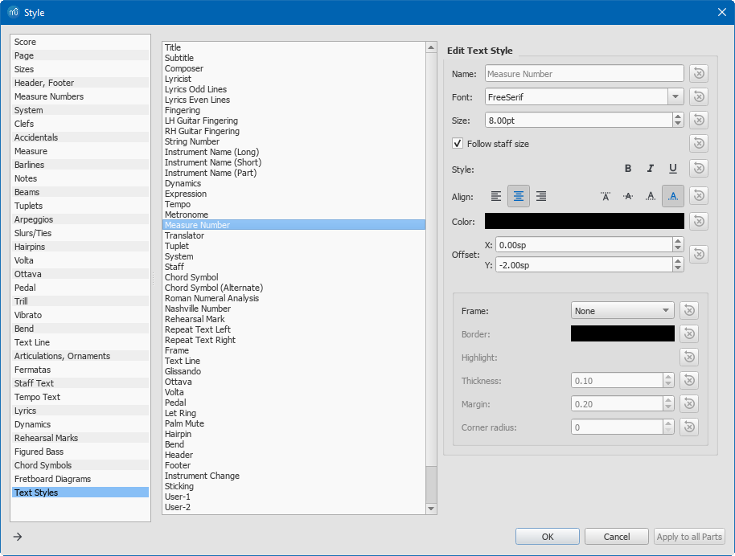

A note about the structure of a piece often aids students in encouraging them to realise the amount of memorising they have to do is reduced where music repeats. Careful analysis can also show where music subtly deviates from previous similar material. Do not hesitate to add staff text (Ctrl + T) or rehearsal marks (Ctrl + M) to highlight the structure of the music or give indications. These can also be added from the menu **Add → Text**. In music with many rests, such as band parts, again some idea of what is going on during the rests speeds up finding the right place in rehearsal. There are several ways to indicate what is going on in other parts. If the piece of music contains lyrics, you might want to add a text above the staff to indicate to the instrument player when the singer will sing. In MuseScore, you can add text to any note. Select a note or a rest, and press Ctrl + T. Then enter the text and click somewhere else. You can then drag and drop the text to reposition it. If you are working on an orchestra piece, it is often done to add cue notes. You can enter cue notes as normal notes and then make them smaller by selecting **small** in the **Chord** section of the **Inspector** (F8).
 
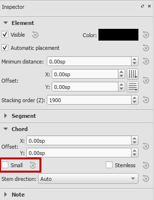

Saving your preferred style
---------------------------

Once you have decided all your relevant preferences, you will want to save these preferences to apply them to existing scores or to create new scores with the same preferences. All you then will need need to do is organise the page breaks and check the density left to right perhaps pushing more bars into some systems or alternatively having more line breaks. To save your preferences, you can save your style settings, and apply them to imported scores or you can create a template and use it to create new scores.

### Saving and loading style

MuseScore let you save a style file (.mss) in **Format → Save Style**. A style file will capture all the settings done in the **Format** menu from both the **Style** and **Page Layout** dialogs. You can load a Style file in a score to quickly change its appearance to your MSN preferences. You will only need to go through the score and fix the line and page breaks and eventually the collisions. Styles are also the perfect tool when you want to adapt an existing score in MSCZ format or in the various formats that MuseScore can import. Just import the file, apply your style and 90% of the work is done.

### Using templates

If you use MuseScore to compose or to transcribe from paper, you might prefer to use a template instead of a style file. A template is basically a MuseScore file, with an associated style, page settings, and instruments. If you are often transcribing for a SATB choir, you can create a score for SATB, change the style and page settings and save the score without any notes in the template folder of MuseScore. The template folder is defined in **Edit → Preferences → General → Templates**. Restart MuseScore and create a new score. In the New Score Wizard, choose Create from template and select your newly created template. You are ready to enter notes in a score with MSN style.

Conclusion
----------

The flexibility of MuseScore enables you to create MSN scores efficiently. As of MuseScore version 3.0, several features will make the process even easier. If you are producing MSN scores with MuseScore, feedback is very much welcome in the MuseScore forums at http://musescore.org/en/forum or reach out directly at http://musescore.com/contact Next to the MuseScore software, there is also the MuseScore community which is so generous to share the work they create with MuseScore. For instance all of Beethoven’s Piano Sonatas are available in MuseScore format for download. Apply the MSN style to the MuseScore files and you’re set to go.

Appendix
--------

Original score “Monologue and Minuet” by Michael Thomas Andrew [MAn final Solo for Bass Viol_musescore](../images/MAn%20final%20Solo%20for%20Bass%20Viol_musescore.pdf) Same score in MSN format [MAn final Solo for Bass Viol_MSN](../images/MAn%20final%20Solo%20for%20Bass%20Viol_MSN.pdf) The making-of video: http://www.youtube.com/watch?v=RDFx8PZR46Y&hd=1 A shorter MSN tutorial created by Rishi: [musescore msn tutorial](../images/musescore%20msn%20tutorial.docx)

License
-------

This document is licensed under [Creative Commons BY](https://creativecommons.org/licenses/by/4.0/) MuseScore.org . Please share!