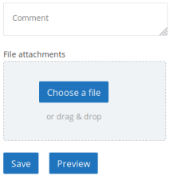
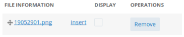

to a conversation in the forum to ask for support 
Use the "File attachments" option at the bottom of the page, just above the <kbd><samp class="button">Save</samp></kbd> and <kbd><samp class="button">Preview</samp></kbd> buttons when you're typing your post. Click on <kbd><samp class="button">Choose a file</samp></kbd>

 

it is also allowed to attach a backup file (starting with a dot, ending with a comma).
Remember, after selecting the file, to use the <kbd><samp class="button">Save</samp></kbd> button.
After attaching the file, in the case of an image, you can insert it in the message.
Move your cursor in your reply (or post) where you want the picture then click the insert link (the underlined blue word insert)

 

Allowed file formats: jpg jpeg gif png txt doc xls pdf ppt pps odt ods odp xml mxl msc mscz mscx mscz, mscx, docx musicxml ts mid midi ly zip eps patch svg ove drm mss cap gp3 gp4 gp5 gpx gp qml tg 7z bww capx mpal kar sgu scw gtp gt3 gt4.

The maximum allowed size is 4 MB.

Compress the file using zip or 7z  for files exceeding that size or not being among the allowed extensions.
