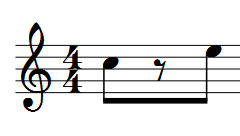

1. Enter a 8th note, followed by a 8th rest, followed by a 8th note.

2. Select the rest.

3. In the "Beam Properties" palette, click the second icon: "Middle of beam" (double-click in versions prior to 3.4).

The video shows it with MuseScore 2, but it works that way with MuseScore 1 and 3 too.
