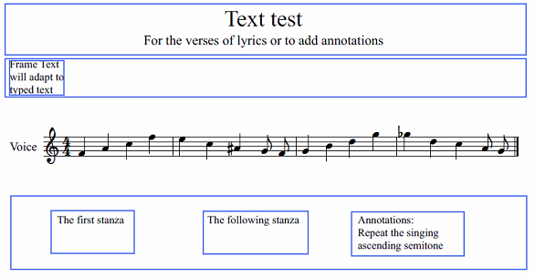

For additional stanzas of lyrics or to add annotations, etc. This is a tutorial for MuseScore 1, and does not apply to MuseScore 2.
<ol>
<ol>
<li>Create a new score by setting, in the dialog box "Create New Score" Title, Subtitle, Composer, and the other information </li>
<li>Highlight the first measurement and from the menu select <kbd><samp class="menu">Create</samp> → <samp class="menuitem">Measures</samp></kbd><samp class="menuitem"> Insert (or Append) </samp> → <samp class="menuitem"> Vertical Frame</samp></kbd>
</li>
<li>By double-clicking we can vertically resize the frame
<li>A click with the right button in the frame just inserted to:
- Add Text Frame, a frame that will fit the text you type;
- Add Insert Horizontal Frame, a frame that with a double click we can resize horizontally and with a click  highlight and drag
</li>
<li>We can prevent a frame from displaying on-screen by unchecking <kbd><samp class="menu">View</samp> → <samp class="menuitem">Show Frame</samp></kbd>. (Frames are never visible in printed output.)
</ol>