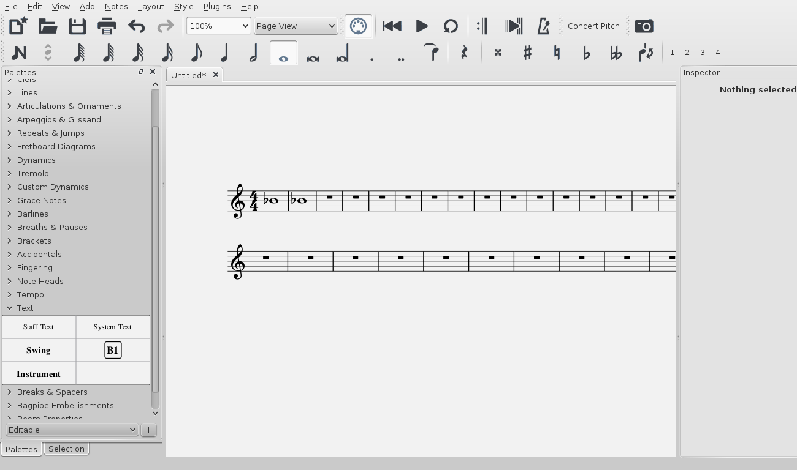

MuseScore allows you to change the sound of an instrument mid-staff. So you can alternate strings between arco, pizzicato, and tremolo, or apply a mute to a trumpet, and so on. 
The following instructions use __pizzicato strings__ as an example, but the same principles apply to tremolo strings or muted trumpet.

1. Select the first note of the section you want to be pizzicato;
2. From the menu, chose <samp class="menu">Add</samp> &rarr; <samp class="submenu">Text</samp>&rarr;<samp class="menuitem">Staff Text</samp>;
3. Type <kbd>pizz.</kbd> At this point, the staff text is a visual reference and not applied during playback;
4. Right-click on the staff text and select <samp class="menuitem">Staff Text Properties...</samp>;
5. In the Staff Text Properties dialog, select one or more voices on the left (in the Change Channel tab);
6. From the dropdown menu, select <samp>pizzicato</samp>

7. Click <kbd><samp>OK</samp></kbd> to return to the score.

Every note after the staff text you added now sounds pizzicato. To return to a normal strings sound later in the piece, repeat the above series of instructions but at step 3 type "arco," and at step 6 select <samp>normal</samp>.

#### Video

