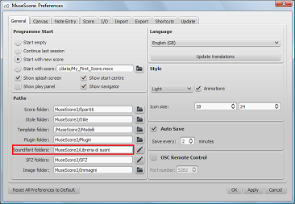
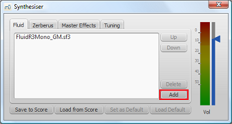
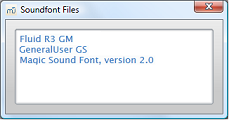

_See [node:36171,title="soundfont"] and [node:61391,title="synthesizer"] for complete instructions for MuseScore 2._

1. In Preferences verify the path of the "Soundfont folder"
    
2. After finding and decompressing a SoundFont, move the file into this folder (or open the SoundFont File with MuseScore to copy it to the folder)
3. In MuseScore, go to <samp class="menu">View</samp>&rarr;<samp class="menuitem">Synthesizer</samp>
    
4. Click on the Add button in the Fluid tab
    
5. Select the SoundFont you want from the list in the dialog—it will be added to the top of the list in the Synthesizer with just one click
