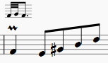
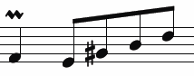
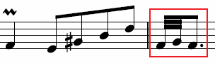
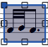
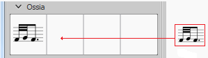

A workaround to producing an ossia via image capture: in this case to produce an "ornament explanation."
1. Insert the note and the ornament on the desired measure:

2. In another measure, insert the notes to be used as the "explanation" in the ossia:

3. Toggle [node:8672,title="image capture"] mode (the camera icon);

4. Draw a selection rectangle around the ornament explanation:

5. Right-click on the selection and, from the menu, chose "Save As (screenshot mode)"; For best results and same resolution as the normal score, use 360 DPI.

6. From where the file is saved, drag and drop to just above the relevant measure;

7. Double-click the added image to edit it to the desired size (see [node:8672,fragment="save-snapshot",title="Save snapshot"]):

 If desired, the image can be saved to a user workspace: hold <kbd><kbd>Ctrl</kbd></kbd> + <kbd><kbd>Shift</kbd></kbd>, and drag-and-drop the image from the score to the correct custom palette:

### See also

* [node:46236,title="How to create an ossia with another staff"].
