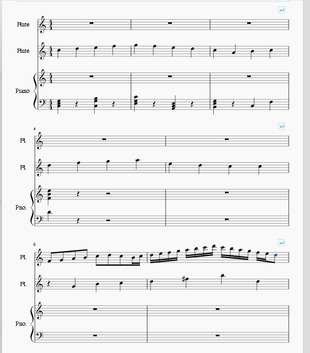

1. Create your score with an additional staff for the ossia (use the "Add Staff" button in the Instrument dialog to add the additional staff to the same instrument);
2. Enter all notes normally (including the ones for the ossia);
3. Add line breaks if needed to make the ossia fit;

4. To set the ossia staff to print smaller than the principal staves, right click on a space in a measure (or the instrument name) and select __Staff Properties__. Check the tickbox labelled "Small staff" (you can also change the long and short instrument names for this staff to "Ossia" on the same dialogue panel);

5. If needed, use the "never hide" option for the other staves;

6. From the main menu, select <samp class="menu">Style</samp>&rarr;<samp class="menuitem">General...</samp>&rarr;<samp class="menuitem">Score</samp>. Check the option  "Hide empty staves". (Also clear the tickbox for "Don't hide empty staves in first system" if necessary);

7. Create parts manually;
8. Readjust breaks as needed to correct score layout;

9. If needed, you can select measures of the ossia staff with no notes and make them invisible. To do this, right-click on a blank space within a measure, select __Measure Properties__, and uncheck the "Visible" tick-box in that dialogue.

 The barline ending the previous measure will remain visible, but not the one ending the measure seleceted. If needed, you can make an individual barline invisible by selecting it and typing <kbd><kbd>V</kbd></kbd>.

You can extend barlines to span staves as required. Select the barlines you want lengthened and specify the number of staves to span in the Inspector.

If needed, you can add staff text to the ossia staff in the usual manner.

### See also

* [node:46226,title="How to create an ossia with image capture"]
