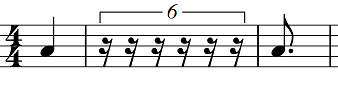
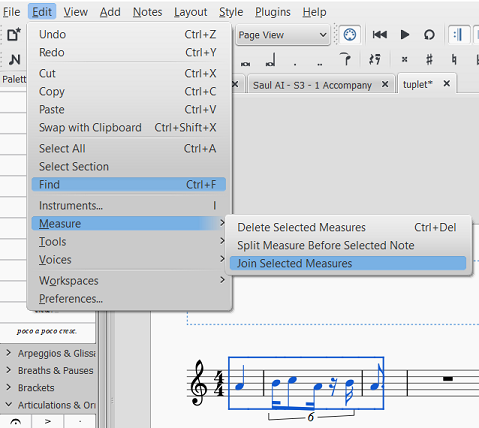

This explains how to make tuplets out of durations that are not normally expressed by a single note or rest.
In MuseScore, to make a tuplet you must enter a single note or rest and change it to a tuplet. Durations such as nine 16th notes cannot be expressed by a single note. Here is how to work around this limitation:

1. Determine the overall duration of the tuplet and enter rests to fill that time. I have used a note to indicate where the next note or rest will be, but you can use a rest if you want to.

2. Select the first rest that will start the tuplet and in the menu select Edit &rarr; Measure &rarr; Split Measure Before Selected Note.
  

3. Select the note or rest after the tuplet and in the menu select Edit &rarr; Measure &rarr; Split Measure Before Selected Note as in the previous step.
 

4. You will now have 3 measures where you previously had 1. The middle measure will have a measure rest in it.

5. Select the rest and create a [node:36061,title="tuplet"] as you would any other.

6. Enter the notes and rests you want into the tuplet.

7. Select all three measures you created and use the menu Edit &rarr; Measure &rarr; Join Selected Measures.

8. You will now have the tuplet in the measure where you want it.
 

**Notes**: When you split the measure, it will split the measure for every instrument in the same system. It is highly advisable to enter such tuplets before entering notes in the other instruments. If you must enter notes into other instruments before creating these tuplets, you will need to find a measure where no other instruments have notes. Work there and then copy the measure to its final location. If you do this, you need to fill the tuplet with any notes and rests before you copy it. There is a bug in MuseScore that causes a corruption in these tuplets after they are copied. You may not be able to properly edit them in the final location after you have pasted them.