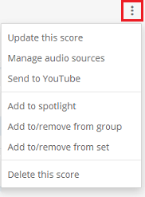

Want to delete a score shared on MuseScore.com?

<ol>

<li>When viewing your score, click the button at the top right.

</li>

<li>Press the "Delete" button at the bottom.</li>

<li>You will be prompted for confirmation: "Are you sure you want to delete [Title of your score]?". This action cannot be undone.</li>

<li>Press "Delete" again, or click on "Cancel" if you don't wish this.</li>

</ol>
