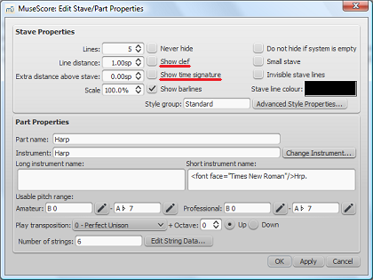

for the music of the XIV century and other occasions.

<ol>

<li>Create a new score by setting in the dialog box "Create New Score" the desired value (12/2 in the example above) and at least two measures

</li>

<li>Enter the notes starting from the second measure</li>

<li>Highlight the first measure and press <kbd><kbd>Ctrl</kbd>+<kbd>Del</kbd></kbd>, or from the menu select <kbd><samp class="menu">Edit</samp> → <samp class="menuitem">Delete Selected Measures</samp></kbd>

Done!</li>

</ol>

<strong>With version 2.x</strong>

<ol>

<li>Highlight the Time Signature with a click and press <kbd><kbd>Del</kbd></kbd> or uncheck the relative box as in the image below

<li>Highlight the first bar with a right-click, select Stave Properties and uncheck the box Show clef

</li>

</ol>
