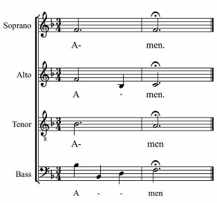

or reinsert them after the modifications to the score
1. Using a word processor (even Notepad is adequate) arrange the text by splitting into syllables. Type the syllables, followed by a dash <kbd><kbd>-</kbd></kbd> and then type <kbd><kbd>Space</kbd></kbd>; If your lyrics are in english, you can use [this tool](http://juiciobrennan.com/hyphenator/) to automate the process.
2. Copy it, as usual, with <kbd><kbd>Ctrl</kbd>+<kbd>C</kbd></kbd>(Mac: <kbd><kbd>Cmd</kbd>+<kbd>C</kbd></kbd>);
3. Select first note, enter lyrics mode by pressing <kbd><kbd>Ctrl</kbd>+<kbd>L</kbd></kbd> (Mac: <kbd><kbd>Cmd</kbd>+<kbd>L</kbd></kbd>);
4. Press and hold <kbd><kbd>Ctrl</kbd>+<kbd>V</kbd></kbd> (Mac: <kbd><kbd>Cmd</kbd>+<kbd>V</kbd></kbd>). Press the "V" in succession: every time you press "V" will release a syllable;
5. Note: if you need to skip a note, release <kbd><kbd>Ctrl</kbd></kbd>, use <kbd><kbd>Space</kbd></kbd> to go to the next note and repeat step 3.

    To achieve the correct position of the dashes as in the following image
    

    we type:

    1. Soprano
        A <kbd><kbd>Alt</kbd>+<kbd>-</kbd></kbd>, <kbd><kbd>Space</kbd></kbd> men. The key combination leaves the dash next to the first syllable;

    2. Alto
        A <kbd><kbd>-</kbd></kbd> men. The dash will be placed in the middle between the first and the second syllable (melisma). Center it correctly with <kbd><kbd>Ctrl</kbd>+<kbd>Alt</kbd>+<kbd>-</kbd></kbd>. The dash will be located below the next note;

    3. Bass
        A <kbd><kbd>Space</kbd></kbd>, <kbd><kbd>Ctrl</kbd>+<kbd>Alt</kbd>+<kbd>-</kbd></kbd> men. The dash will be positioned below each note in between.

**External links** for automatic hyphenation: 

* https://juiciobrennan.com/hyphenator/
* http://www.sillabare.it/divisione-in-sillabe/divisione-in-sillabe.php