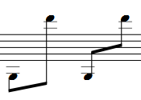

If two neighbouring notes have contrasting vertical positions and share a beam, it may be preferable to situate it between the notes instead of below or above them.
1. Double-click the beam to enter edit mode; two handles appear - the left one is for moving the beam vertically and the right one is for adjusting the angle.
2. Move the left handle between the notes. Adjust the right handle afterward if you want.
