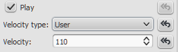

Dynamics do not work after opening a MIDI file in MuseScore 2 or 3
After opening a MIDI file, you may find that dynamics, and crescendo and diminuendo lines do not affect playback as expected. To fix the problem:

1. Open (import) the [node:22918,title="MIDI"] file;
2. Open the [node:38491,title="Inspector"] (<kbd><kbd>F8</kbd></kbd> or "View&rarr;Inspector") if it's not already open;
3. Select any note, then right click and choose "Select&rarr;Select all similar elements";
4. In the [node:38491,fragment="note",title="Note"] section of the Inspector, locate the "Velocity Type" and "Velocity" properties (near the bottom). E.g.

5. Click on the "Reset to default" buttons for both values.

This should reset all note velocities to MuseScore's default value (i.e. "Offset" and 0), and restore correct playback of dynamics and hairpins.