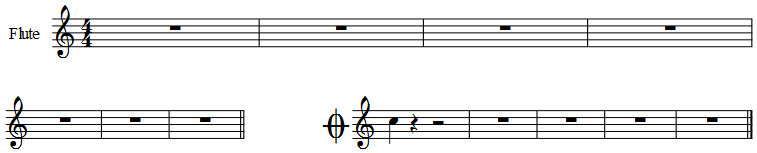

1. Select the first measure of the coda.
2. Go to <samp>Add</samp>&rarr;<samp>Frames</samp>&rarr;<samp>Insert Horizontal Frame</samp>.
3. Double-click the frame and resize it with the blue handle, if necessary.
### Video
https://www.youtube.com/embed/VBjVkHRoJ58

### Score demo
[separateCoda](../images/separateCoda.mscz)
