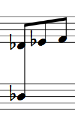

A chord spreading over two staves.

1. Add three eighth notes (quavers) in the upper staff.

2. Add an eighth note on the lower staff.

3. For MuseScore 3: disable Autoplace for that note's stem.

4. Double-click the lower eighth note's stem - a blue handle should appear.

5. Drag the handle to extend the stem until it joins with the stem in the upper staff.

    Alternativly to steps 4 and 5  (and im MuseScore 2 and 3) you can also select the stem (single click) and change its length in Inspector.

6. Make the lower eighth note's flag/beam invisible (select it and press <kbd><kbd>V</kbd></kbd>).

7. Make any unwanted rests invisible.

The invisible flag and rests will appear grey on the screen, but will not appear if you print or save as PDF. If you don't want them to appear on the screen, go to <kbd><samp class="menu">View </samp>&rarr;<samp class="submenu">Show Invisible</samp></kbd>.

It may be necessary to insert a Staff spacer fixed down to maintain the set placement.

### See also {#see-also}

* [node:36031,title="Cross-staff notation"] (MuseScore 2.x)

* [node:278597,title="Cross-staff notation"] (MuseScore 3.x)

* [#14687]
