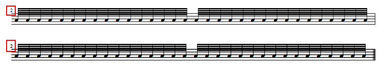

If measures are too long to fit on a single system, a solution is to place a system break in the middle.

<ol>
<li><strong>Create an empty measure after the one you want to have split in two:</strong> Select the measure after the one you want to split and <kbd><samp class="menu">Create</samp> → <samp class="submenu">Measure</samp> → <samp class="submenu">Insert Measure</samp></kbd>, or press <kbd><kbd>Ins</kbd></kbd>. If it's the last measure in your score, use <kbd><samp class="menu">Create</samp> → <samp class="submenu">Measure</samp> → <samp class="submenu">Append Measure</samp></kbd>, or with the keyboard <kbd><kbd>Ctrl</kbd>+<kbd>B</kbd></kbd> (Mac: <kbd><kbd>⌘</kbd>+<kbd>B</kbd></kbd>).</li>
<li><strong>Move the notes that shall go to the new system to the new empty bar:</strong> Select all notes after the position where the system break should go and <kbd><samp class="menu">Edit</samp> → <samp class="submenu">Cut</samp></kbd> or press <kbd><kbd>Ctrl</kbd>+<kbd>X</kbd></kbd> (Mac: <kbd><kbd>⌘</kbd>+<kbd>X</kbd></kbd>). Please make sure your selection spans all staves of the system. After that, select all staves of your second measure and <kbd><samp class="menu">Edit</samp> → <samp class="submenu">Paste</samp></kbd> or press <kbd><kbd>Ctrl</kbd>+<kbd>V</kbd></kbd> (Mac: <kbd><kbd>⌘</kbd>+<kbd>V</kbd></kbd>).</li>
<li><strong>Adjust actual measure durations of both measures:</strong> Now you have to delete the rests at the end of both measures. On each measure, right-click the measure, <kbd><samp class="menu">Measure Properties...</samp></kbd> and change the Actual Duration. For example, if you are in 4/4 time and moved a section with one quarter length to the second bar, make the first bar 3/4 and the second 1/4 in actual duration.
<li><strong>Hide bar line:</strong> Right-click on the bar lines between your two measures and <kbd><samp class="menu">Make Invisible</samp></kbd> from the menu.</li>
<li><strong>Force a system break, if necessary:</strong> If the second measure is still on the same system as the first, select the bar line between the measures by clicking on it and press <kbd><kbd>Return</kbd></kbd>. You can also drag a system break from the palette onto the bar line.</li>
<li><strong>Fix measure numbering:</strong> Right-click the measure on the new staff and <kbd><samp class="menu">Measure Properties...</samp></kbd>. You can either enter -1 to the "add to measure number" field, which gives your new measure the same number as the previous one, but makes the measure number appear normally in front of the system. Alternatively, you can mark it "irregular", which also avoids your measures being counted as two, but does not show a measure number, so you can create one yourself - perhaps in parentheses using a text field (<kbd><kbd>Ctrl</kbd>+<kbd>T</kbd></kbd>).</li>
</ol>
