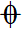

Successfully using jumps and repeats as of version 3.1.

## Repeats

### Changing number of repetitions

When you add an end repeat (which resembles :|| ) to a score, MuseScore automatically sets the Play count in Measure properties to 2. If you want more repeats you need to 

 * right click the last measure before repeat
 * choose measure properties
 * change the play count to the total number of times the section of music is played.
 * click ok

### Mid-measure repeats

To make mid-measure repeats that look and playback properly, you first need to split the measure. Select the first note after the repeat and choose the menu Tools->Measure->Split measure before selected note. You can then insert a repeat barline where the measure is split. It is advisable to select one of the halves of the measure (normally the second half), right click it, choose measure properties and check the “Exclude from measure count” box.

## Voltas

### Adding a volta

Voltas are often used for alternate endings to be played during repeats. To add a volta, select all of the measures you want it to affect and double click it in the palette. Do __not__ drag the volta to the score if you want it to cover more than one measure. If you have an existing volta and want it to affect more or fewer measures, double click the volta, select the end you want to move and use shift+left or right arrow keys to adjust it. It will always adjust complete measures. __Important:__ Using other methods to adjust the volta like dragging an end or using ctrl+ arrows will only change the way it looks, it will not change the measures it affects.

The following is a picture of a volta that was improperly added:
 

The volta was added to the first measure, then the right end of the volta was dragged to make it look correct. Notice the red line to the first measure under the volta when the volta is put into edit mode. Only the first measure under the volta will be skipped the second time through.

### Editing voltas

There are several voltas that are pre-setup in the lines palette but can still be edited if they do not meet your needs. If you have changed the play count to greater than 2, you probably need to change the effect and display of the voltas. 

To edit volta display, select it and open the inspector. Pressing F8 will open or close the inspector as needed. To change the text displayed in the volta, check the “Begin text” box and type what you want it to display in the “Text” field. You may optionally change the “Text” field in the "Continue text" section to show what it displayed if the volta spans more than one line, though this is not normally used. I've never seen the "End text" used for a volta, but you may edit that if you need to.

To edit the volta playback, you need to edit the "Repeat list." You must list every time through the repetition you want played and separate them with commas. With proper combinations of voltas and repeats you can have rather complex ending orders.
  

Errata: The play count for volta 1 should be set to **3** not *4*

#### “Rogue” voltas

You can insert a volta in the middle of a repeat section and the measures under the voltas will only play on the times through the repeat indicated in the "Repeat list." This is not considered proper use of voltas, but it works.

### Jumps

The jumps and repeats palette contains all defined jumps and repeats in MuseScore. In order for jumps to work correctly the proper jump labels must be entered from the palette in the correct order. If you fail to enter the jump labels properly, the probable result is that all jumps will be ignored but the results are not always formally defined so you may get unexpected jumps.

Here is the order jump labels must appear in MuseScore.
 

__D.S.__ - This tells MuseScore to return to the segno and play to the end of the score or section.

_or_
  

__Fine__
__D.S. al Fine__ – This tells MuseScore to return to the segno and play until the Fine is encountered.

_or_
 

__to Coda__
__D.S. al Coda__ – This tells MuseScore to return to the segno and play until the "to Coda" is encountered at which point there is a jump to the
 and play until the end of the section (or score)

_or_

__D.C.__ - When this is the only jump, MuseScore will return to the start of the section (or score) and play until the end of the section (or score)

_or_

__Fine__
__D.C al fine__ – This tells MuseScore to return to the start of the section (or score) and play until it encounters a Fine

_or_

__to Coda__
__D.C. al Coda__ – This tells  MuseScore to return to the start of the section (or score) and play until it encounters the "to Coda" at which point there is a jump to the 
  and plays until the end of the section (or score)

Playing repeats the second time through
In the inspector there is an option to play repeats the second time. To set this option, select the D.S. or D.C. label and check “Play repeats” in the inspector.

#### Jumps and voltas

One important thing to keep in mind is that jump labels should not be under a volta. There are some exceptions to this, but jumps under voltas are not normal notation and should be avoided. Also, if a segno, “Fine,” or “To coda,” is under a 2nd Volta that will never be reached, the D.C./D.S. will be ignored. The best rule is to use duplicate measures (for example an identical measure under the 1st volta and in the coda section) where necessary to avoid putting jumps under voltas.

On the subject of Jumps and voltas. Voltas require repeat barlines to indicate playback count so the volta know which repeat is being played. Even though a D.C. or D.S. causes a measure to be played multiple times, this count is not taken into consideration for voltas. A volta in the middle of a jump section with no repeat will not playback properly. It will always be ignored (the music under it will always be played) or it will always be skipped (the music under it will never be played) depending on the volta's playback settings.

### Sections
Section breaks are used to indicate the end of movements in symphonic pieces and individual exercises in an exercise book. In general, sections act as the equivalent of a score. Jumps, in general do not look outside of a section for labels. There is one exception. If there is no Coda symbol in the current section, MuseScore will look in the following section(s) for a Coda symbol to jump to.

### Editing labels

Jump labels are text and can be edited like any other text. As long as the proper label is entered, the text can say anything you like. One common change is to put a    in the “to Coda” label. Keep in mind, you must enter the “to Coda” label and change the text to the symbol. You cannot enter a Coda sign from the Jumps and Repeats palette. Keep in mind, that you can edit a label and put it into a [custom palette](https://musescore.org/en/handbook/3/palettes#custom-palettes) for later use.

You may select any label and edit it's function in the Jump section of the [inspector](https://musescore.org/en/handbook/3/inspector). In the D.S. or D.C. label you will see Jump to:, Play until: and Continue at. By default these match the default segno, start of score, to Coda, coda, Fine and end of score functions in the score and Jump labels. You can edit these so that you can have multiple D.S. al codas in one section for example.

You would enter the first group of labels in the normal manner. After the last jump label, you can start entering a second set of labels. By default it jumps to segno (which is defined in the segno), Plays until coda (defined in to Coda) and continues at codab (defined in the {Coda symbol}). You can change these in all of the second groups of labels. I suggest that you simply add a 2 to the end of the labels to indicate this is the second group of labels and so forth. Another possibility is to use the Coda and Segno variations. Remember to adjust all of the jump labels to match. It helps both you and MuseScore keep the labels straight.

On thing to keep in mind, you cannot jump from one set of labels into the middle of or beyond another set of labels. So a D.S. al Coda cannot jump back to before a previous D.S. al Coda, even if the labels are changed as in the previous paragraph.

## Unrolling the score

Version 3.1 has a new feature that has not been much discussed. It is limited in its usefulness, but can be used as a diagnostic tool if your jumps do not work correctly. Also, if playback is important in sections with different instrumentation or dynamics, then this tool is useful for hearing it played properly or to eliminate the need to turn the the page back during live performances.

To use the Unroll tool, in the Tools menu select Unroll Repeats. When you select this option, a new tab is opened with the score laid out in the order the measures will be played. The tab is not marked dirty (the * after the name) unless you edit it after it is created. The name of the tab will be the same as the original with “_unrolled” appended to the end of it. This is a safeguard to prevent accidental overwriting of the original score. There is no “reroll” option, so it's best to not save it with the same name as the original score.