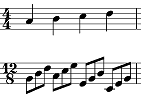
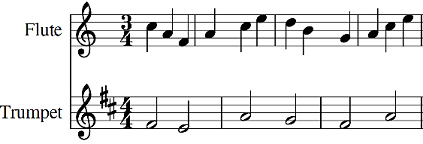
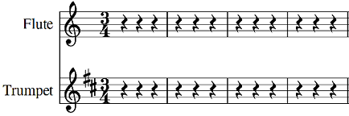
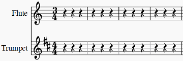
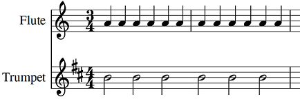
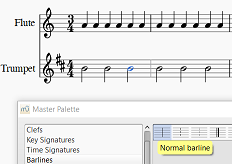

This page is still under construction. I am working on adding pictures, links and formatting. Please be patient until this message is removed.

This is a description of how to use the features in MuseScore to create songs with polyrhythms and local time signatures. There are several methods available and I have attempted to explain each along with some possible problems that will arise while using them.

## Polyrhythms and Mixed Meters

Polyrhythms (mixed meters) are sections of music where one instrument is playing in one time signature while another has a different time signature. There are several limitations to using polyrhythms in MuseScore. Most of these are related to the use of local time signatures.

One limitation in MuseScore is that local time signatures do not allow uneven measures on different instruments at the same time. For example, you cannot have the flute playing in 3/4 while the trumpet is playing in 4/4 and the start of the measures lineup only every 4 measures. However, there is a way to work around this limitation which will be explained [below](#modify-measures).

There are actually three ways to enter polyrhythms into MuseScore. One is [using local time signatures](#local-time-signature) another is to [modify a global time signature](#modify-global-time-signature) and the last is to [modify measures](#modify-measures). 

These instructions will explain how best to use each method. Each individual situation will require the user to decide which method is best to use. This decision will normally need to be made prior to entering the polyrhythm section of music.

Before making these modifications to the time signature, it is strongly advised that you make a backup copy of your score. If your score become corrupt or unusable, it will minimize the amount of work required to start again.

### Local Time Signature {#local-time-signature}

First a reminder, a [node:35941,fragment="local-time-signatures",title="local time signature"] is added by pressing <kbd><kbd>Ctrl</kbd></kbd> (<kbd><kbd>Cmd</kbd></kbd> on a Mac) while dragging the time signature from a palette to a measure of music. This time signature can be a predefined time signature from the basic or advanced [node:36121,fragment="workspaces",title="workspaces"] or a [node:36121,fragment="custom-workspace",title="custom work space"] as well as a [node:35941,fragment="create-your-own-time-signature",title="custom time signature"] from the master palette or a custom work area. (Reminder, pressing <kbd><kbd>Shift</kbd>+<kbd>T</kbd></kbd> will bring up the Time Signatures master palette.)

#### Limitations to local time signatures:

In the limitations that follow I have often used the word "may" rather than "will." This is because the results in MuseScore are inconsistent. For example, sometimes you CAN change the time signature of a later measure, sometimes you can't. I have not been able to understand what causes this inconsistent behavior. It is best to expect the worst case on all of these limitations, so they do not affect your ability to enter your score should they arise. It will also help prevent the score from becoming corrupted. Fixing corruptions with local time signatures is not as simple as exchanging voices. You will most likely have to scrap what you have done and start over. When I have used the word "will," I have always seen the results stated.

Once any measure inside of the section affected by the local time signature is changed in any way, MuseScore will not allow copying, cutting from or pasting into any measure affected by the local time signature. Even if you make a change to a measure, then undo it, MuseScore may still see the measure as changed. You also may not be able to change the time signature of any following measure. This even means that if you need to change back to the global time signature, you may get an error while entering a global time signature in the score. MuseScore may also have problems entering [node:36061,title="tuplets"] into these measures. 

There is one shortcoming to all local time signatures. If you delete one, then every local time signature on every instrument in the same measure will be deleted. If you have modified any measures inside the range of a local time signature different than the global time signature, you will get an error if you try to delete any local time signature that affects that measure. Fortunately, you can undo the entering of the wrong local time signature and all will be as before it was entered. Of course, you may have to undo a lot depending on what you did after entering the time signature.

Local time signatures are ideal for sections of music that the user would not want to copy to other locations in the score. It is also preferred if you want the notes beamed in a certain pattern. If the local time signature does not last to the end of the score, you will need to enter all of the local time signature changes up to and including the next global time signature before entering any notes. If you enter a note and undo it, MuseScore may still think the measure has been changed and you may not be able to enter the next time signature. If the line of music returns to the same time signature as the global time signature, you can enter a local time signature that is the same as the global time signature. MuseScore will recognize it as being the same as the global time signature and the editing problems will not exist after this return to the global time signature.

### Using a local time signature {#using-local-sig}

Here is a sample from a string quartet using local time signatures. Start by entering the notes in the lines using the main time signature. In this case 12/8

Once this is done you will want to enter the local time signatures (4/4 in this case) and the next time change after the local time signatures (12/8 in this case).

Once the time signatures are added, you can enter the notes as needed.

It is possible to paste notes into the 12/8 sections, but not the 4/4 sections. While making this score I copied the first measure into the fourth measure for all instruments.

### Modifying the global time signature {#modify-global-time-signature}

First a definition. A **global time signature** is a time signature applied to all instruments starting at a specific measure.

If you press <kbd><kbd>Ctrl</kbd></kbd> (<kbd><kbd>Cmd</kbd></kbd> on a Mac) while dragging the same time signature as the global time signature to a measure,  it will insert the same time signature into the destination measure. MuseScore reccognizes that this is the same time signature, so almost none of the limitations of a local time signature will exist. If there is a global time signature change for all instruments in a measure where you need to modify the time signature, it is not necessary drag the time signature to a single instrument again. When you modify the global time signature for a single instrument, the modified time signature will only appear on the instrument where you changed the display. 

MuseScore does have a couple of issues to be aware of.

One issue to be aware of when using this option is that if you enter the time signature into several staves in the same measure, and then delete one of the time signatures, all of the time signatures in this measure will be deleted. The good thing is that it will not affect the notes you already entered. Other than that, it will only affect the beam groupings until you undo the delete or enter and edit the time signature again.

Another problem is a known bug in MuseScore that is being worked on. Some tuplets that end at the end of the measure will work fine as far as copying and pasting the entire tuplet is concerned until you save the score. At this point, MuseScore has done its calcuations and thinks the tuplet extends past the end of the measure, and it becomes impossible to select the entire tuplet. Any cut, copy or delete action on the tuplet will result in an error. For example, if your polyrhythm consists of 4/4 and 10/8 you may run into this problem. To decrease the chances of this being a problem, you can use the time signature with more beats in it as the global time signature and the the one with fewer beats as the local time signature. However, this may require you to modify more instruments time signatures than you leave unmodified.

###Changing the time signature display {#change-display-signature}

Changing the time signature display is simple. When you right click the time signature and select [Time Signature Properties...](https://musescore.org/en/handbook/time-signatures#local-time-signatures), you can change the displayed time signature to any legal time signature including common time (the one that looks like a C) and cut time (the one that looks like a C with a line through it). You can also change the groupings of the beams. This allows you to have most of the instruments with a time signature such as 3/4, while some of the instruments have a 6/8 time signature without needing to make any further modifications to the score, such as using tuplets. The 3/4 time signature normally has the 1/8 notes in a group of two and a group of four, while the 6/8 time signature normally has two groups of three 1/8 notes. You can change the beaming at the same time you are changing the displayed time signature. What you cannot change is the number of beats represented by the time signature simply by editing its properties.

When there are a different number of beats in the two time signatures it is necessary to use [node:36061,title="tuplets"] to display and properly play the notes in one of the time signatures, normally the one with the fewest instruments playing it will be the local time signature. If the global time signature is 3/4 and you want some of the instruments playing in 7/8, you will need to change each measure playing 7/8 into a 7th-let using either <kbd><kbd>Ctrl</kbd>+<kbd>7</kbd></kbd> (Mac <kbd><kbd>Cmd</kbd>+<kbd>7</kbd></kbd>) or Notes &rarr; Tuplets... from the menu. After the tuplets are created the numbers and brackets can be removed by selecting them and changing their display in the inspector if not already done from the Tuplets... dialog. One limitations to this method is that you cannot set the beam groupings inside of a tuplet. The [node:36046,title="beam"] groupings are according to MuseScore's predefined algorhythm. You can expect to need to change beam groupings of these measures.

Once this is done, you can enter your notes. You can also copy and paste entire measures at a time (unless MuseScore thinks your tuplet crossed into the next measure). When pasting into one of these measures, you must delete existing tuplets (if any) prior to pasting, or you will get an error. You also cannot use the Swap with Clipboard command (introduced in version 2.1) on destination measures with any tuplets in them.

Depending upon the situation, you may want to change one measure at a time to a tuplet rather than the entire section all at once. Doing this will allow you to copy an existing measure into a measure with a modified time signature with out getting an error or needing to delete the existing tuplet first.

Here is the same example used in the local time signature section using local time signatures instead. Both will will sound the same when played.

First enter the main time signature and the notes not affected by time signature changes.

I have chose to enter the first violin (1st line) all in 4/4 so it is not necessary to enter the 12/8 time signature again. I have entered the 12/8 signatures into the viola (3rd line) and cello (4th line) parts.

Next right click the time signature.

Select Time Signature properties and see this window.
  

Change the displayed time signature.

### Modifying measures. {#modify-measures}

   {#picture1}

When measures do not line up among instruments it is necessary to modify each individual measure.

In spite of the long winded explanation of polyrhythms above, they are actually quite simple and not very tedious once you understand how to use them. When the measures do not line up, it gets a bit more tedious to make them work properly.

I will remain with my example in the introduction and explain how to notate a flute playing 3/4 while a trumpet is playing 4/4. Of course, the process is the same for any instruments you chose and you many use more that two instruments. You will usually want to chose the time signature that has the shorter duration for the global time signature and insert it into the score. In my example I have chosen the 3/4 time signature for the flutes. 

The next thing to do is to make all of the bar lines in the other instrument, in this case the trumpet, invisible. You can right click any bar line and chose <kbd><samp class="menu">Select</samp> &rarr; <samp class="menuitem">All Similar Elements in Same Staff</samp></kbd>. If the different time signatures only applies to a certain portion of the score, then select that portion of the score before right clicking. Next, right click a bar line in the section and chose <kbd><samp class="menu">Select</samp> &rarr; <samp class="menuitem">All Similar Items in Range Selection</samp></kbd>. Once the desired bar lines are selected, press <kbd><kbd>V</kbd></kbd> and all of the selected bar lines will become invisible. **Bar lines cannot be deleted**. You may want to see the invisible bar lines. If you do, then ensure the menu <kbd><samp class="menu">View</samp> &rarr; <samp class="menuitem">Show Invisible</samp></kbd> is checked. At this point you will probably want to change the displayed time signature in the trumpet to 4/4 as explained [above](#change-display-signature).

You may want to enter both instruments' notes at the same time. This will make it easier to keep track of where measures belong. As you enter the trumpet notes, you may find that some of the notes cross the 3/4 bar line that is invisible. When you enter the note, MuseScore will display it as tied notes. You will want to delete these notes. You will then need select the two measures where the note crosses the bar line and use the menu <samp class="menu">Edit</samp>&rarr;<samp class="menuitem">Measure</samp>&rarr;<samp class="menuitem">Join Selected Measures</samp> to make one longer measure. You can now enter the note that would have crossed the bar line and it will appear as expected.

If, in our example, the trumpet plays a lot of whole notes or half notes as in the picture at the start of this [section](#picture1), it will be less work to change the bar lines on the flute. In this case you will want to use the longer time signature (4/4 in our example) for the main time signature. It is the same process no matter which time signatures are involved.

#### Replace the missing barlines {#replace-barlines}

If you are entering notes into MuseScore as you are reading this, you probably noticed that many barlines a missing. You will need insert the missing bar lines. In the example we are working on, this means most bar lines for the trumpet and possibly some bar lines for the flute are missing. Entering a new bar line is easy. Open the master palette either by pressing <kbd><kbd>Z</kbd></kbd>, <kbd><kbd>Shift</kbd>+<kbd>F9</kbd></kbd>, or using the menu <samp class="menu">View</samp>&rarr;<samp class="menuitem">Master Palette...</samp>. Once it is displayed, click "_Barlines_" from the list on the left. Select the note **AFTER** the bar line and either double click the appropriate bar line or drag it to the note **AFTER** the bar line's destinaton. This is different than using the basic or advanced palette to enter a bar line. From those you must select the note **BEFORE** where you want the bar line to be entered. 

In the above picture, the barline will be placed before the selected note which is blue.

If there is an invisible bar line where you want one to occur, then select the bar line and press <kbd><kbd>V</kbd></kbd> to make it visible. You cannot put a bar line from the master palette on a bar line already in the score. While using the master palette, you can select multiple notes and/or rests and double click the bar line so one will appear before each note or rest. Don't forget to also enter any bar lines you removed from the flute if you merged measures.

There is one other thing you may need to do while entering bar lines. You may find notes that should cross bar lines, but are represented by single notes. You will need to change these into tied notes yourself in order to make them look correct and be able to enter a bar line between these tied notes.